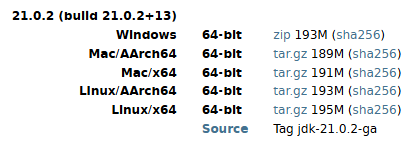

# OpenJDKのインストールおよび設定

## 概要

本章では、Javaアプリケーションの開発および実行に必要な OpenJDK をインストールします。

## 利用バージョン

| ソフトウェア | バージョン |
| --- | --- |
| OpenJDK | 21.0.2 |

## zipファイルのダウンロード

OpenJDKの公式サイトのダウンロードページへアクセスします。

- ダウンロードページ
  - https://jdk.java.net/archive/

OpenJDK 21.0.2 をダウンロードしてください。



## OpenJDKのインストール

ダウンロードしたzipファイルを任意のディレクトリに解凍します。

解凍先の例は以下の通りです。（もし管理者権限がなければ個人のユーザプロファイル領域の任意のディレクトリに解凍すること。）

例:

```text
C:\Program Files\Java\jdk-21
```

## 環境変数の設定

### 環境変数画面を開く

以下のいずれかの方法で「環境変数」画面を開きます。

#### 方法1: スタートメニューから開く

1. Windowsのスタートメニューを開く
2. 「環境変数」と検索する
3. 「システム環境変数の編集」をクリックする
4. 「環境変数」ボタンをクリックする

#### 方法2: ファイル名を指定して実行から開く（推奨）

1. `Windows + R` キーを押す
2. 「ファイル名を指定して実行」を開く
3. 以下のコマンドを入力して実行する

```cmd
rundll32 sysdm.cpl,EditEnvironmentVariables
```

4. 環境変数画面が表示される

### JAVA_HOMEの設定

システム環境変数に以下を設定します。

| 変数名 | 値 |
| --- | --- |
| JAVA_HOME | C:\Program Files\Java\jdk-21 |

### Pathの設定

システム環境変数の `Path` に以下を追加します。

```text
%JAVA_HOME%\bin
```

## 動作確認

コマンドプロンプトまたは PowerShell を起動し、以下のコマンドを実行してください。

```bash
java -version
```

実行結果例

```text
openjdk version "21.0.2" 2024-01-16
OpenJDK Runtime Environment (build 21.0.2+13-58)
OpenJDK 64-Bit Server VM (build 21.0.2+13-58, mixed mode, sharing)
```

続いて以下のコマンドを実行します。

```bash
javac -version
```

実行結果例

```text
javac 21.0.2
```

上記のようにバージョン情報が表示されれば設定は完了です。
