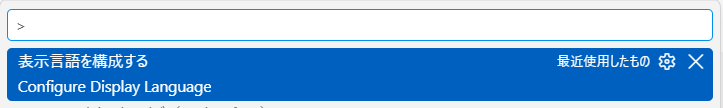
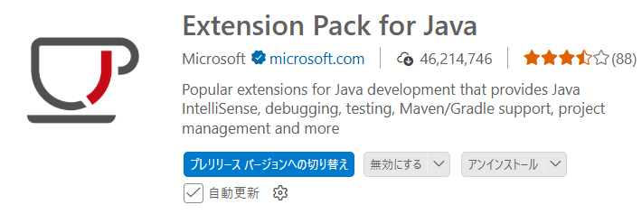
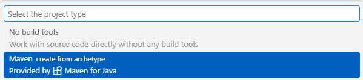
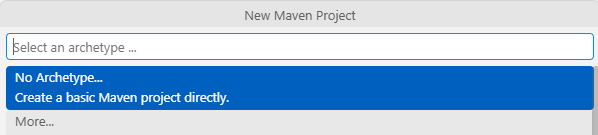
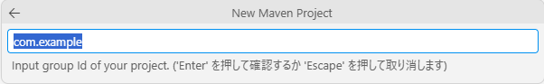
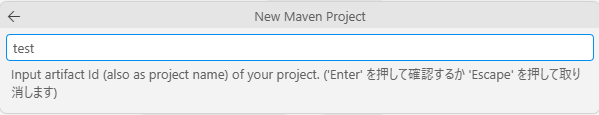
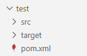
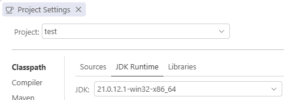
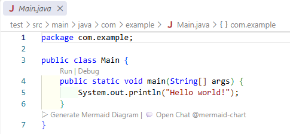
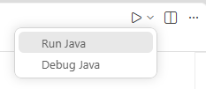

# VS Codeの設定手順

## 1. VS Codeをインストール

公式サイトからダウンロードします。

https://code.visualstudio.com/download?_exp_download=fb315fc982

ダウンロードしたインストーラを起動し、インストール完了後、VS Codeを起動します。

## 2. VS Codeを日本語化する

VS Codeは初期状態では英語表示の場合があります。

### 日本語言語パックをインストール

左側メニューの **Extensions（拡張機能）** を開きます。

ショートカット:

```text
Ctrl + Shift + X
```

検索欄に以下を入力します。

```text
Japanese Language Pack for Visual Studio Code
```

Publisher:

```text
Microsoft
```

の拡張機能をインストールする。

### 日本語へ切り替え

下記のショートカットキーからコマンドパレットから実行する。

```text
Ctrl + Shift + P
```

検索欄に以下を入力する。

```text
Configure Display Language
```




表示された一覧から「日本語(ja)」を選択し、VS Codeを再起動します。


### 日本語化確認

メニューが以下のような日本語表示になれば成功です。

```text
ファイル
編集
選択
表示
実行
ターミナル
```

>[!Note] 下記の手順はJDK、Git、Mavenのインストール後に実施すること。


## 3. Java開発用拡張機能のインストール

VS Code左側の「Extensions」を開き、以下の拡張機能をインストールします。

### Extension Pack for Java

Publisher: Microsoft



以下の主要なJava拡張機能がまとめてインストールされます。

- Language Support for Java™ by Red Hat
- Debugger for Java
- Test Runner for Java
- Maven for Java
- Project Manager for Java
- IntelliCode

## 4. Java開発環境設定

### Javaプロジェクト作成

コマンドパレットから実行します。

```text
Java: Create Java Project
```

ビルドツールに

```text
Maven
```

を選択します。



Mavenアーキタイプを利用してプロジェクトを作成する。

アーキタイプ（Archetype）は、Mavenプロジェクトのひな形（テンプレートです。）

ここでは最小構成のプロジェクトでよいので、No Archetypeを選択します。



次に、Group ID（ベースパッケージ）を入力する。

ここでは、デフォルトで入力されている「com.example」をそのままとしてEnterをクリックする。



次に、Artifact ID（プロジェクト名）を入力する。



フォルダ選択ダイアログが表示されるため、新規Javaプロジェクトの保存先を指定し、プロジェクトを作成する。

VSCode上の左側にあるエクスプローラーから、src、target、pom.xmlがある構成の新規作成したJavaプロジェクトが作成される。



### Java環境の認識確認

コマンドパレットを開きます。

```text
Ctrl + Shift + P
```

以下を実行します。

```text
Java: Configure Java Runtime
```

Project Settingsファイルが表示される。

インストール済みのJDKが認識されていることを確認できる。



### Java実行の動作確認

プロジェクト内のsrc/main/java配下にMain.javaファイルがあることを確認します。




右上の「Run Java」ボタンを押して実行します。



ターミナルが開き、下記の内容が出力される。

```text
Hello World!
```

### MavenコマンドによるビルドとJavaの実行

ターミナルを開き、プロジェクト内のpom.xmlファイルがある場所までcdコマンドで移動し、Mavenコマンドが実行できるか確認する。

```powershell
mvn clean install
```

実行結果：

```text
[INFO] ------------------------------------------------------------------------
[INFO] BUILD SUCCESS
[INFO] ------------------------------------------------------------------------
[INFO] Total time:  4.835 s
[INFO] Finished at: 2026-mm-ddThh:MM:dd+09:00
[INFO] ------------------------------------------------------------------------
```

ビルド後にJavaを実行する場合は、以下のコマンドを実行すること。

```powershell
 mvn exec:java "-Dexec.mainClass=com.example.Main"
```

実行結果：

```text
Hello world!
[INFO] ------------------------------------------------------------------------
[INFO] BUILD SUCCESS
[INFO] ------------------------------------------------------------------------
[INFO] Total time:  0.749 s
[INFO] Finished at: 2026-mm-ddThh:MM:dd+09:00
[INFO] ------------------------------------------------------------------------
```

## 5. 推奨拡張機能一覧

### Javaの開発で必須

| 拡張機能 | 用途 |
| --------- | ---- |
| Extension Pack for Java | Java開発総合パック |
| Language Support for Java by Red Hat | Java言語サポート |
| Debugger for Java | デバッグ |
| Maven for Java | Maven対応 |
| Project Manager for Java | プロジェクト管理 |
| Test Runner for Java | JUnit実行 |

### コード品質向上

| 拡張機能 | 用途 |
| --------- | ---- |
| SonarLint | 静的解析 |
| Checkstyle for Java | コーディング規約チェック |
| Error Lens | エラー表示強化 |

### Git関連

| 拡張機能 | 用途 |
| --------- | ---- |
| GitLens | Git履歴確認 |
| Git Graph | ブランチ可視化 |

### データベース関連

| 拡張機能 | 用途 |
| --------- | ---- |
| SQLTools | SQL実行 |
| Database Client JDBC | DB接続 |

### 開発効率向上

| 拡張機能 | 用途 |
| --------- | ---- |
| IntelliCode | AI補完 |
| Path Intellisense | パス補完 |
| Todo Tree | TODO管理 |
| EditorConfig | フォーマット統一 |
