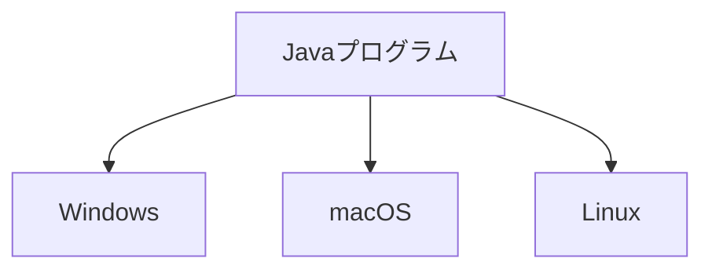
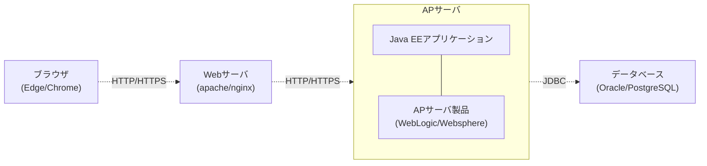
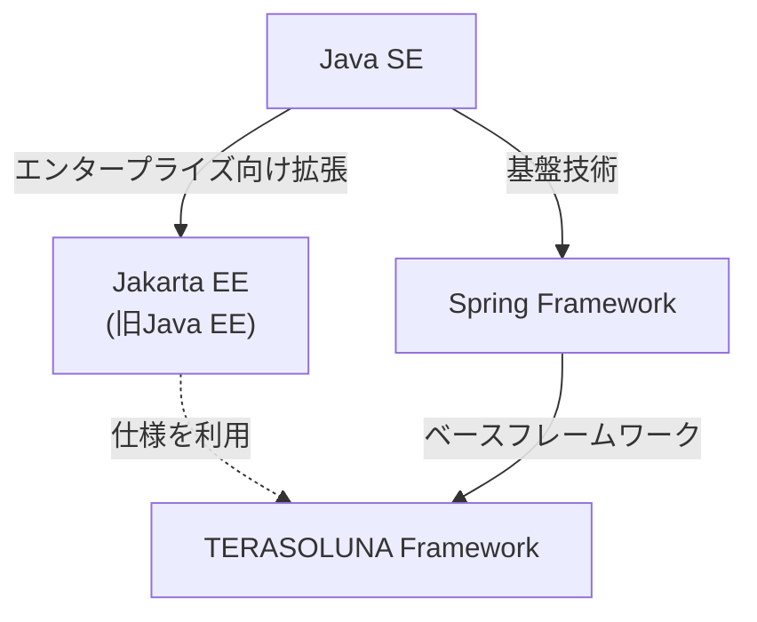

# Java

## この章で学ぶこと

- Javaとはどのようなプログラミング言語なのか理解する
- Javaがどのようなシステムで使われているか知る

## Javaとは

Javaは、世界中で利用されているプログラミング言語の一つである。

Webアプリケーション、業務システム、スマートフォンアプリ、組み込み機器など、さまざまなシステムの開発に利用されている。

本書で学習するTERASOLUNA FrameworkもJavaを利用して作られているため、TERASOLUNAを理解するためにはJavaの基礎知識が必要となる。

## Javaでできること

Javaはさまざまなシステム開発で利用されている。

例)

- Webアプリケーション
- ECサイト
- 銀行システム
- 在庫管理システム
- スマートフォンアプリ(Android)

## Javaがよく利用される理由

### 1. OSに依存しにくい

JavaはWindows、macOS、Linuxなど異なるOS上で動作できる。



同じプログラムを複数のOSで実行しやすい特徴を持つ。

### 2. 大規模システム開発に向いている

Javaは企業向けの業務システムで広く利用されている。

例)

- 銀行システム
- 販売管理システム
- 人事管理システム

そのため多くの企業で採用されている。

### 3. ライブラリやフレームワークが豊富

Javaには様々な便利なライブラリやフレームワークが存在する。

例)

|名称|用途|
|---|---|
|Spring Framework|Webアプリケーション開発|
|TERASOLUNA Framework|Spring Frameworkをベースとした業務システム開発フレームワーク|
|JUnit|単体テスト|
|MyBatis|データベースアクセス（SQLマッピング）|

開発者はこれらのライブラリやフレームワークを活用することで、効率的にWebアプリケーションや業務システムを開発することができる。

### 4. 実行速度が比較的高い

Javaはコンパイル済みのバイトコードをJVM上で実行する。

また、JIT(Just-In-Time)コンパイラによる最適化が行われるため、スクリプト言語と比較すると高速に動作する場合が多い。

#### Javaの注意点

Javaには多くの利点がある一方で、開発時に手間がかかる部分もある。

#### ビルドが必要

Javaは実行前にコンパイルを行い、クラスファイルを生成する必要がある。

## Javaのエディション

Javaには用途に応じて複数のエディションが存在する。

主に以下の2つを理解しておけばよい。

|エディション|概要|
|---|---|
|Java SE (Standard Edition)|Javaの標準機能を提供する基本パッケージ|
|Jakarta EE（旧Java EE (Enterprise Edition))|企業向けWebシステム開発のための拡張仕様|

### Java SE (Standard Edition)

Java SEはJavaの基本機能を提供する。

例)

- クラス
- オブジェクト指向
- コレクション(List、Map、Set)
- 例外処理
- 入出力
- ネットワーク通信

本章で学習する内容の多くはJava SEの機能である。

```java
public class HelloWorld {
    public static void main(String[] args) {
        System.out.println("Hello Java");
    }
}
```

### Java EE (Enterprise Edition)

Java EEは企業向けシステム開発のための仕様群である。

主に以下のような機能を提供する。

- Webアプリケーション
- トランザクション管理
- データベース連携
- セキュリティ
- REST API

Java EEは銀行システムやECサイトなどの大規模な業務システムで広く利用されてきた。



APサーバ製品（WebLogic、WebSphere Libertyなど）はJava EE仕様を実装しており、Java EEアプリケーションの実行環境を提供する。

TomcatもJavaアプリケーションの実行基盤として利用されるが、WebLogicやWebSphereのようなフル機能のAPサーバではなく、主にWebアプリケーション向けの軽量なコンテナである。

### Jakarta EE

現在のJava EEは「Jakarta EE」という名称に変更されている。

Spring FrameworkやTERASOLUNA FrameworkもJakarta EEの技術を利用して動作している。

なお、本書ではJakarta EEの詳細は扱わず、Spring FrameworkおよびTERASOLUNA Frameworkを中心に学習する。

### TERASOLUNAとの関係

TERASOLUNA Frameworkは以下の技術を組み合わせて構成されている。



そのため、まずはJava SEの基礎知識を理解することが重要である。

## まとめ

- Javaは世界中で利用されているプログラミング言語である
- 業務システムやWebアプリケーション開発で広く利用されている
- JavaはWindowsとmacOSとLinuxで実行できる
- TERASOLUNA FrameworkはJavaを利用して開発するためのフレームワークである
- TERASOLUNAを学ぶ前にJavaの基礎を理解する必要がある

## 参考資料

### Oracle Java Documentation

Javaの公式ドキュメント

https://docs.oracle.com/en/java/

➡️ [次へ](./02_java-execution.md) 🏠 [ホーム](./README.md)
