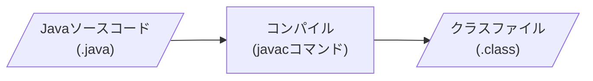
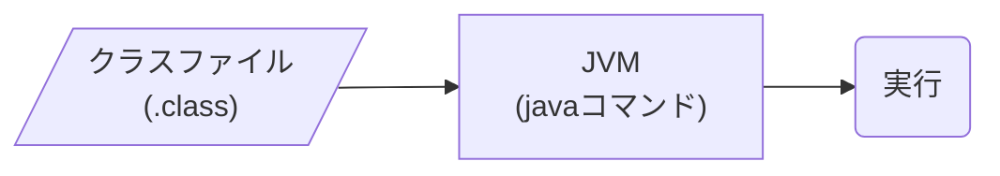
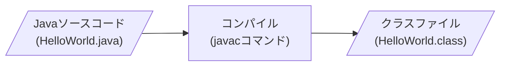
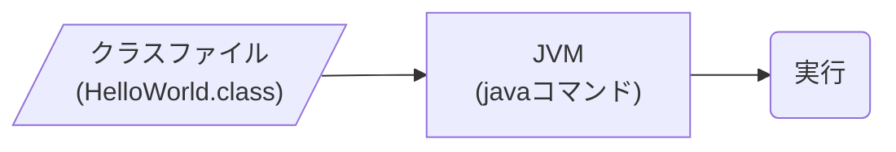

# Java実行の仕組み

## この章で学ぶこと

- Javaプログラムが実行される流れを理解する
- ソースコードとクラスファイルの違いを理解する
- JVMの役割を理解する
- なぜJavaが様々なOSで動作するのか理解する

## Javaプログラムはどのように実行されるのか

Javaはソースコードを直接実行することはできない。

まずソースコードをコンパイルして、クラスファイルを作成する。



その後、JVMを使って実行する。



## Javaソースコード

開発者はJavaのソースコードを作成する。

例)

```java
public class HelloWorld {

    public static void main(String[] args) {
        System.out.println("Hello Java");
    }

}
```

ファイル名

```text
HelloWorld.java
```

### 💡 ポイント①（クラス名とファイル名）

Javaでは以下のルールを守る。

```text
クラス名      = HelloWorld
ファイル名    = HelloWorld.java
```

クラス名とファイル名が一致していない場合、コンパイルエラーとなる。

### 💡 ポイント②（クラス名の命名規則）

Javaではクラス名をパスカルケース（PascalCase）で命名する。

パスカルケースとは、各単語の先頭を大文字にして連結する命名規則である。

例)

```java
User
UserInfo
EmployeeService
OrderController
```

### 💡 ポイント③（フィールド名・メソッド名の命名規則）

フィールド名やメソッド名はキャメルケース（camelCase）で命名する。

キャメルケースとは、先頭の単語を小文字、その後の単語の先頭を大文字にして連結する命名規則である。

例)

```java
userName
employeeService
orderController
getUserName()
```

### 💡 ポイント④（パッケージ名の命名規則）

Javaではクラス名との区別を明確にするため、パッケージ名は小文字で記述する習慣となっている。

また、パッケージ名は一意性を高めるため、組織や会社が保有するドメイン名を逆順にして利用することが一般的である。

例)

```java
package jp.co.sample.service; //← パッケージ名

public class UserService {   //← クラス名
}
```

### 💡 ポイント（命名規則のまとめ）

|対象|命名規則|例|
|---|---|---|
|クラス名|PascalCase|UserService|
|インターフェース名|PascalCase|UserRepository|
|メソッド名|camelCase|getUserName|
|フィールド名|camelCase|userName|
|パッケージ名|lowercase|jp.co.sample.user|

## コンパイル

Javaソースコードはそのままでは実行できない。

JDKに含まれるコンパイラ(javac)を利用してクラスファイルへ変換する。



コマンド実行例：

```bash
javac HelloWorld.java
```

## クラスファイル

コンパイル後に生成されるファイルである。

```text
HelloWorld.class
```

クラスファイルにはJava仮想マシン(JVM)が理解できる命令が格納されている。

## JVM(Java Virtual Machine)

JVMはJavaプログラムを実行するための仮想的な実行環境である。



コマンド実行例：

```bash
java HelloWorld
```

## まとめ

Javaプログラムは「コンパイル」と「JVM」によって実行される。


- Javaソースコード(.java)は直接実行できない
- javacでコンパイルを行う
- コンパイル後にクラスファイル(.class)が生成される
- JVMがクラスファイルを実行する
- JVMがあることでWindows、macOS、Linuxで同じプログラムを実行できる

## 参考資料

### Oracle Java Documentation

Javaの公式ドキュメント

- [Java Documentation](https://docs.oracle.com/en/java/)

### Java Tutorials

Javaの基本的な考え方や文法を学習できるチュートリアル

- [The Java Tutorials](https://docs.oracle.com/javase/tutorial/)

⬅️ [前へ](./01_java.md) ➡️ [次へ](./03_jdk-jre-jvm.md) 🏠 [ホーム](./README.md)
