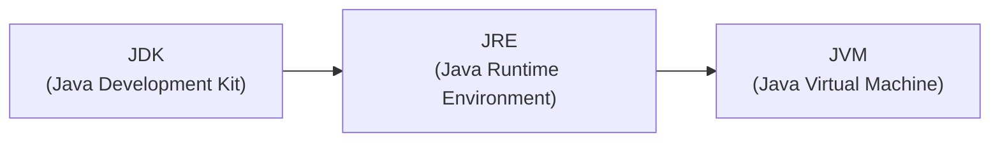
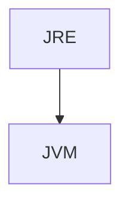
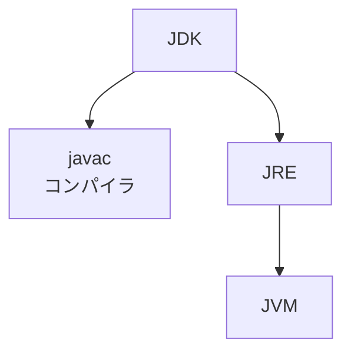
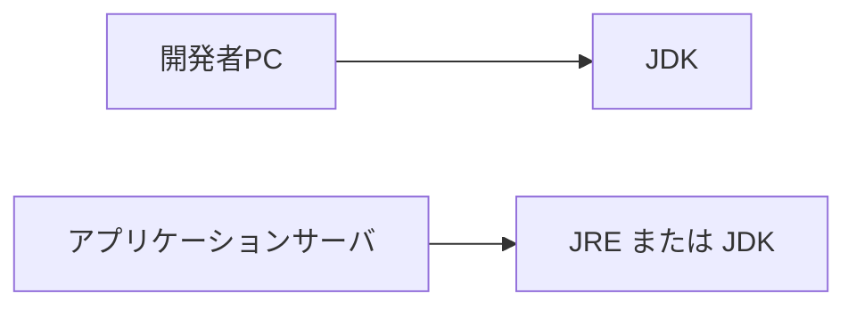

# JDK / JRE / JVM

## この章で学ぶこと

- JDK、JRE、JVMの違いを理解する
- Javaプログラムを開発・実行するために必要な環境を理解する
- javacコマンドとjavaコマンドの役割を理解する


## JDK・JRE・JVMとは

Javaには以下の3つの重要な要素が存在する。

|名称|役割|
|---|---|
|JDK|Javaプログラムを開発するための環境|
|JRE|Javaプログラムを実行するための環境|
|JVM|Javaプログラムを実行する仮想マシン|


## 関係図

JDKはJREを含み、JREはJVMを含んでいる。




## JVMとは

JVM（Java Virtual Machine）はJavaプログラムを実行する仮想マシンである。

コンパイルによって生成されたクラスファイルを実行する。


JVMが存在することで、同じJavaプログラムを異なるOS上で実行できる。

Windows/macOS/Linux、それぞれのOS向けのJVMが提供されている。

## JREとは

JRE（Java Runtime Environment）はJavaプログラムを実行するための環境である。

JREにはJVMが含まれている。



コンパイル済みのJavaプログラムを実行するだけであればJREで実行可能である。


## JDKとは

JDK（Java Development Kit）はJavaプログラムを開発するための環境である。

JDKには以下が含まれている。

- JRE
- JVM
- javac（コンパイラ）
- その他開発ツール



Java開発者は通常JDKをインストールする。


## javacコマンド

javacはJavaソースコードをコンパイルするためのコマンドである。

例)

```bash
javac HelloWorld.java
```

実行後

```text
HelloWorld.class
```

が生成される。


## javaコマンド

javaコマンドはJVMを起動し、クラスファイルを実行するためのコマンドである。

例)

```bash
java HelloWorld
```

実行結果

```text
Hello Java
```


## 開発環境と実行環境

一般的な構成例



開発者PCではコンパイルを行うためJDKが必要である。

コンパイル済みのJavaアプリケーションを実行するだけであればJREで実行可能である。

そのため、従来は本番サーバにJREのみを配置する構成が一般的であった。

なお、現在では運用管理の都合から本番サーバにもJDKを配置するケースが多い。


## 💡 ポイント

|項目|JDK|JRE|JVM|
|---|---|---|---|
|開発|〇|×|×|
|実行|〇|〇|〇|
|javac|〇|×|×|
|javaコマンド|〇|〇|×|
|主な利用者|開発者|利用者・サーバ|実行環境|


## まとめ

- JVMはJavaプログラムを実行する仮想マシンである
- JREはJavaプログラムを実行するための環境である
- JDKはJavaプログラムを開発するための環境である
- JDKにはJREが含まれる
- JREにはJVMが含まれる
- Java開発では通常JDKを利用する

## 参考資料

### Oracle Java Documentation

- [Java Documentation](https://docs.oracle.com/en/java/)

### Java SE Documentation

- [Java SE Documentation](https://www.oracle.com/java/technologies/javase-documentation.html)

⬅️ [前へ](./02_java-execution.md) ➡️ [次へ](./04_package-and-class.md) 🏠 [ホーム](./README.md)
