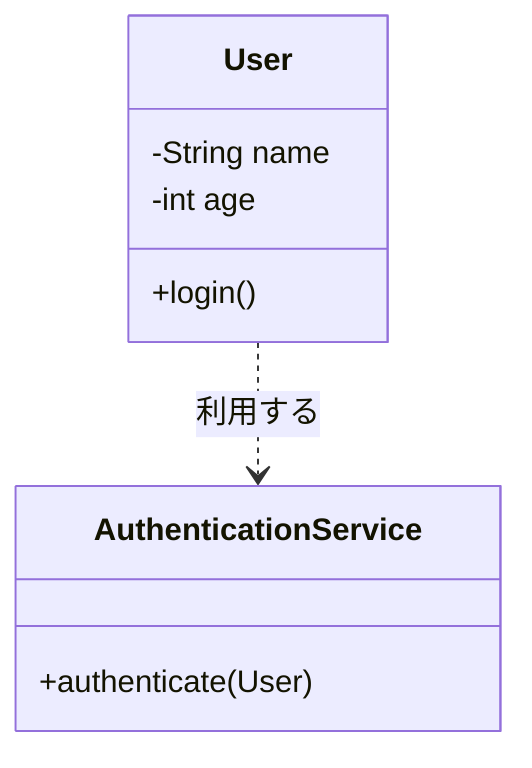

# オブジェクト指向

## この章で学ぶこと

- オブジェクト指向の考え方を理解する
- オブジェクト指向が必要になった理由を理解する

## オブジェクト指向とは

オブジェクト指向（Object Oriented Programming）は、現実世界のモノや概念をプログラムとして表現する考え方である。

例えば、

- ユーザ
- 商品
- 注文
- 社員

などのモノや概念をクラスとして表現する。

また、

- 名前
- 年齢
- 商品名
- 金額

などのデータ（フィールド）や、

- ログインする
- 注文する
- 在庫を確認する
- 社員一覧を問い合わせる

といった処理（メソッド）をまとめて管理する。

## オブジェクト指向を利用した場合

ユーザという共通の概念をまとめて表現できる。

```text
User
 ├─ 名前
 ├─ 年齢
 └─ ログインする
```

これをクラスとして定義する。

```java
public class User {

    // 名前
    private String name;

    // 年齢
    private int age;

    public void login() {
        AuthenticationService.authenticate(this);
    }

}
```



Userクラスは名前や年齢などのデータ（フィールド）を保持し、ログイン処理（メソッド）を持っている。

AuthenticationServiceクラスは、authenticateメソッドを持ち、ユーザの認証処理を担当する。

オブジェクト指向では、このようにデータと処理を関連付けて管理する。

クラスは単独で動作するのではなく、他のクラスと連携しながら処理を実現する。

複数のクラスが役割を分担しながら協力してシステムを構築していくことが、オブジェクト指向の特徴の1つである。

後続で説明するが、Javaではクラスをもとに生成されたものをオブジェクトと呼ぶ。

## オブジェクト指向の目的

オブジェクト指向には以下の目的がある。

### 1. 再利用しやすくする

同じ仕組みを何度も利用できる。

### 2. 保守しやすくする

変更箇所を少なくできる。

### 3. 理解しやすくする

現実世界に近い形でプログラムを表現できる。

## オブジェクト指向の代表的な考え方

オブジェクト指向には代表的な考え方が存在する。

### カプセル化

データと処理を1つにまとめる考え方。

### 継承

既存クラスの機能を引き継ぐ考え方。

### ポリモーフィズム

同じ操作でも異なる振る舞いを実現する考え方。

本書では後続の章で学習する。

現時点では、

```text
オブジェクト指向 = 現実世界のモノをプログラムで表現する考え方
```

と理解しておけばよい。

## まとめ

- オブジェクト指向は現実世界をプログラムで表現する考え方である
- ユーザや商品などをクラスとして表現する
- オブジェクト指向により再利用性と保守性が向上する

オブジェクト指向は、現実世界のモノや概念をプログラムで表現するための考え方である。

⬅️ [前へ](./04_package-and-class.md) ➡️ [次へ](./06_data-types.md) 🏠 [ホーム](./README.md)
