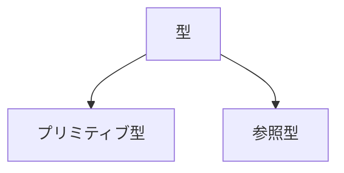
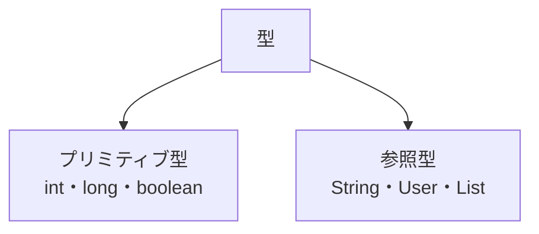

# 型

## この章で学ぶこと

- 型とは何かを理解する
- プリミティブ型と参照型の違いを理解する
- 変数宣言時に型が必要な理由を理解する

## 型とは

型（Data Type）とは、変数にどのような値を格納できるかを定義するものである。

例)

```java
int age = 20;
```

```java
String name = "田中";
```

```java
User user = new User();
```

上記の

```java
int
String
User
```

が型である。


## なぜ型が必要なのか

型を定義することで、プログラムは格納できる値を判断できる。

例)

```java
int age = 20;
```

正しい

```java
age = 30;
```

誤り

```java
age = "田中";
```

コンパイルエラーとなる。


## Javaの型の分類

Javaの型は大きく2種類に分けられる。




## プリミティブ型

Javaが標準で提供する基本的な型である。

|型|説明|例|
|---|---|---|
|byte|整数|100|
|short|整数|1000|
|int|整数|10000|
|long|大きな整数|100000L|
|float|小数|1.23F|
|double|小数|1.23|
|char|文字|'A'|
|boolean|真偽値|true|

例)

```java
int age = 20;

double price = 100.5;

boolean active = true;
```


## よく利用するプリミティブ型

実務で特によく利用する型は以下である。

```java
int
```

整数

```java
int age = 20;
```


```java
long
```

大きな整数

```java
long amount = 1000000L;
```


```java
boolean
```

真偽値

```java
boolean success = true;
```


## 参照型

プリミティブ型以外の型を参照型という。

主な例

```java
String
```

```java
User
```

```java
List
```

```java
Map
```


### String型

文字列を扱う型である。

```java
String name = "田中";
```

Stringは参照型である。


### クラスも型になる

クラスを作成すると、そのクラスを型として利用できる。

クラス

```java
public class User {
}
```

利用

```java
User user = new User();
```


## プリミティブ型と参照型

例)

```java
int age = 20;
```

```java
String name = "田中";
```

```java
User user = new User();
```

分類すると以下のようになる。

|コード|型の種類|
|---|---|
|int age = 20;|プリミティブ型|
|String name = "田中";|参照型|
|User user = new User();|参照型|


## 💡 ポイント

- 型は変数に格納できる値を定義する
- Javaの型は「プリミティブ型」と「参照型」に分類される
- int、long、boolean などはプリミティブ型である
- Stringは参照型である
- クラスも型として利用できる
- Collection(List、Map、Set)も参照型である


## ✅ まとめ



Javaではすべての変数に型が必要である。

型を利用することで、安全にプログラムを作成することができる。


## 📚 参考資料

- Oracle Java Documentation
- The Java Tutorials


⬅️ 前へ: 10-inheritance-and-interface.md

🏠 README.md

➡️ 次へ: 12-collections-and-generics.md