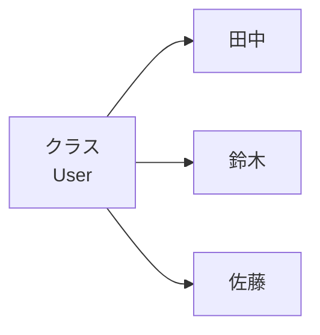
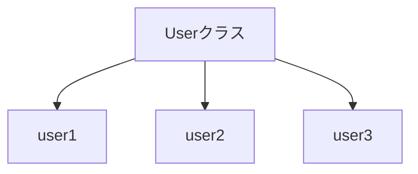
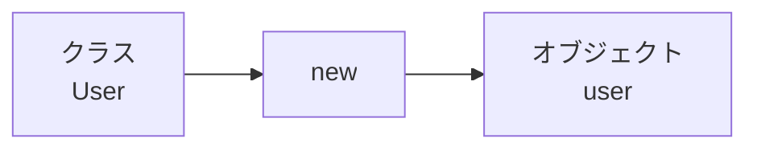

# クラスとオブジェクト

## この章で学ぶこと

- クラスとは何かを理解する
- オブジェクトとは何かを理解する
- インスタンスとの関係を理解する
- newによるオブジェクト生成を理解する

## クラスとは

クラスとは、オブジェクトを作るための設計図である。

例えば「ユーザ」を管理する場合、以下のような情報を持つことができる。

```text
ユーザ
├─ 名前
└─ 年齢
```

Javaではこれをクラスとして表現する。

```java
public class User {

}
```

この時点では、まだ実際のユーザは存在していない。

## オブジェクトとは

オブジェクトとは、クラスから生成された実体である。

例)

```text
クラス
└─ User

オブジェクト
├─ 田中
├─ 鈴木
└─ 佐藤
```

## クラスとオブジェクトの関係

設計図と実物の関係で考えると分かりやすい。



現実世界の例

```text
設計図
↓
自動車
```

```text
実物
↓
プリウス
カローラ
ヤリス
```

Javaでも同じ考え方を利用する。

## オブジェクトを生成する

オブジェクトは new キーワードを利用して生成する。

```java
User user = new User();
```

構造

```java
User
```

型

```java
user
```

変数名

```java
new User()
```

オブジェクト生成

## インスタンスとは

インスタンスとは、クラスから生成されたオブジェクトのことである。

つまり、

```java
User user = new User();
```

で生成された user は

- オブジェクト
- インスタンス

の両方の呼び方ができる。

### 用語の整理

```text
クラス
↓
new
↓
オブジェクト
↓
インスタンス
```

実務では

```text
Userクラスのインスタンス
```

という表現をよく利用する。

## 複数のオブジェクトを生成する

同じクラスから複数のオブジェクトを生成できる。

```java
User user1 = new User();

User user2 = new User();

User user3 = new User();
```

イメージ



## なぜクラスを利用するのか

クラスを利用しない場合

```java
String user1Name;
int user1Age;

String user2Name;
int user2Age;

String user3Name;
int user3Age;
```

大量の変数が必要になる。

クラスを利用した場合

```java
User user1 = new User();

User user2 = new User();

User user3 = new User();
```

同じ仕組みを再利用できる。

## まとめ

- クラスはオブジェクトを生成するための設計図である
- オブジェクトはクラスから生成された実体である
- インスタンスはオブジェクトのことを指す
- オブジェクトは new で生成する
- 1つのクラスから複数のオブジェクトを生成できる



```java
User user = new User();
```

上記コードは、

- User → クラス
- user → 変数
- new User() → オブジェクト生成

を表している。

⬅️ [前へ](./06_data-types.md) ➡️ [次へ](./08_field-and-method.md) 🏠 [ホーム](./README.md)