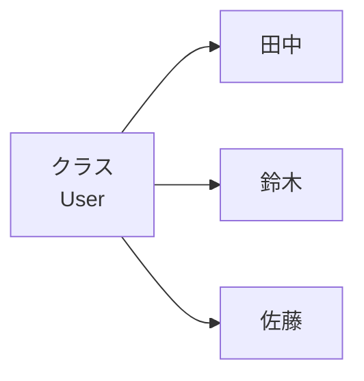

# クラスとオブジェクト

## この章で学ぶこと

- クラスとは何かを理解する
- オブジェクトとは何かを理解する
- インスタンスとの関係を理解する
- newによるオブジェクト生成を理解する


## クラスとは

クラスとは、オブジェクトを作るための設計図である。

例えば「ユーザー」を管理する場合、以下のような情報を持つことができる。

```text
ユーザー
├─ 名前
└─ 年齢
```

Javaではこれをクラスとして表現する。

```java
public class User {
}
```

この時点では、まだ実際のユーザーは存在していない。

## オブジェクトとは

オブジェクトとは、クラスから生成された実体である。

例)

```text
クラス
└─ User

オブジェクト
├─ 田中
├─ 鈴木
└─ 佐藤
```


## クラスとオブジェクトの関係

設計図と実物の関係で考えると分かりやすい。




現実世界の例

```text
設計図
↓
自動車
```

```text
実物
↓
プリウス
カローラ
ヤリス
```

