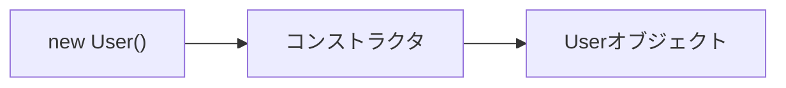
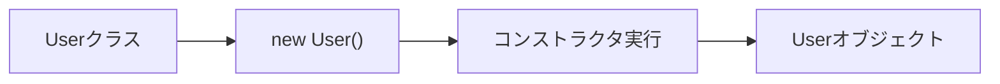

# コンストラクタ

## この章で学ぶこと

- コンストラクタとは何かを理解する
- オブジェクト生成時の処理を理解する
- 引数付きコンストラクタを理解する
- newとの関係を理解する

## コンストラクタとは

コンストラクタ（Constructor）とは、オブジェクト生成時に実行される特別なメソッドである。

例)

```java
User user = new User();
```

上記コードでは、

```java
new User()
```

が実行される際にコンストラクタが呼び出される。

## コンストラクタの特徴

コンストラクタには以下の特徴がある。

- クラス名と同じ名前を持つ
- 戻り値を持たない
- オブジェクト生成時に自動的に呼び出される

例)

```java
public class User {

    public User() {
        System.out.println("コンストラクタが実行されました");
    }

}
```

## コンストラクタの動作

クラス

```java
public class User {

    public User() {
        System.out.println("User生成");
    }

}
```

利用

```java
User user = new User();
```

実行結果

```text
User生成
```

## オブジェクト生成の流れ



## デフォルトコンストラクタ

コンストラクタを定義しない場合、Javaはデフォルトコンストラクタを自動生成する。

例)

```java
public class User {

}
```

内部的には以下と同じ意味になる。

```java
public class User {

    public User() {

    }

}
```

## 引数付きコンストラクタ

コンストラクタには引数を指定できる。

例)

```java
public class User {

    String name;

    public User(String name) {
        this.name = name;
    }

}
```

利用

```java
User user = new User("田中");
```

## 引数付きコンストラクタを利用する理由

オブジェクト生成時に初期値を設定できる。

例)

```java
public class User {

    String name;

    int age;

    public User(String name, int age) {

        this.name = name;
        this.age = age;

    }

}
```

利用

```java
User user =
    new User("田中", 20);
```

## thisとは

thisは現在のオブジェクト自身を表す。

例)

```java
this.name = name;
```

左側

```java
this.name
```

フィールド

右側

```java
name
```

引数

を表す。

## コンストラクタのオーバーロード

同じクラス内で複数のコンストラクタを定義できる。

例)

```java
public class User {

    String name;

    public User() {

    }

    public User(String name) {
        this.name = name;
    }

}
```

利用

```java
User user1 = new User();

User user2 = new User("田中");
```

## コンストラクタを利用しない場合

```java
User user = new User();

user.setName("田中");
user.setAge(20);
```

## コンストラクタを利用する場合

```java
User user = new User("田中", 20);
```

生成時に必要な値を渡せるため、初期化漏れを防ぎやすい。

## まとめ

- コンストラクタはオブジェクト生成時に実行される
- コンストラクタ名はクラス名と同じである
- 戻り値は記述しない
- 引数を受け取れる
- オブジェクトの初期化によく利用される
- Springでも頻繁に利用される



```java
User user = new User();
```

この処理では、

1. コンストラクタが実行される
2. オブジェクトが生成される

という流れで動作する。

⬅️ [前へ](./08_field-and-method.md) ➡️ [次へ](./10_access-modifier.md) 🏠 [ホーム](./README.md)