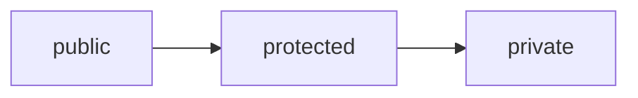

# アクセス修飾子

## この章で学ぶこと

- アクセス修飾子とは何かを理解する
- public、private、protectedの違いを理解する
- フィールドをprivateにする理由を理解する
- getter / setterの必要性を理解する


## アクセス修飾子とは

アクセス修飾子（Access Modifier）とは、クラスやフィールド、メソッドへのアクセス範囲を制御する仕組みである。

例)

```java
private String name;
```

上記の場合、nameフィールドへのアクセスが制限される。


## なぜアクセス制御が必要なのか

例えば以下のようなクラスを考える。

```java
public class User {

    public int age;

}
```

利用側

```java
User user = new User();

user.age = -100;
```

しかし年齢に

```text
-100歳
```

はありえない。

直接変更を許可すると不正な値が設定できてしまう。


## 主なアクセス修飾子

Javaでは主に以下を利用する。

|修飾子|アクセス範囲|
|---|---|
|public|どこからでもアクセス可能|
|protected|同じパッケージまたは継承先からアクセス可能|
|private|同じクラス内からのみアクセス可能|


## public

publicはどこからでもアクセスできる。

例)

```java
public class User {

    public String name;

}
```

```java
User user = new User();

user.name = "田中";
```

アクセスできる。


## private

privateは同じクラス内からのみアクセスできる。

例)

```java
public class User {

    private String name;

}
```

```java
User user = new User();

user.name = "田中";
```

コンパイルエラーとなる。


## protected

protectedは継承したクラスからアクセスできる。

例)

```java
protected String name;
```

継承については後続の章で学習する。

現時点では、

```text
public より制限が強い
private より制限が弱い
```

と理解しておけばよい。


## アクセス範囲のイメージ



```text
public
  ↓
protected
  ↓
private
```

下に行くほどアクセス範囲が狭くなる。


## フィールドをprivateにする

Javaでは