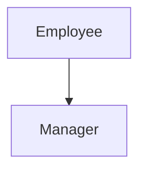
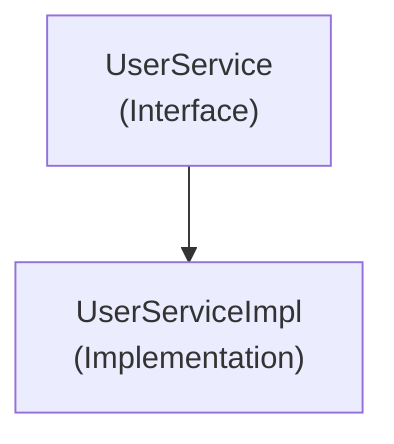
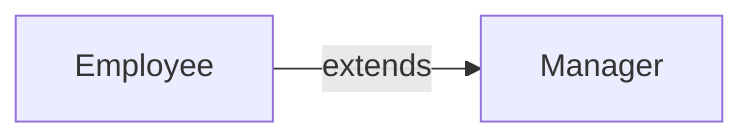
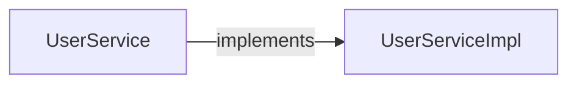

# 継承とインターフェース

## この章で学ぶこと

- 継承とは何かを理解する
- インターフェースとは何かを理解する
- extendsとimplementsの違いを理解する

## 継承とは

継承（Inheritance）とは、既存のクラスの機能を引き継いで新しいクラスを作る仕組みである。

例)

```text
Employee
├─ 社員番号
└─ 名前
```

↓

```text
Manager
├─ 社員番号
├─ 名前
└─ 部署
```

ManagerはEmployeeの機能を引き継ぐことができる。

## 継承の書き方

継承には extends を利用する。

例)

```java
public class Employee {

    String employeeId;

    String name;

}
```

```java
public class Manager extends Employee {

    String department;

}
```

## 継承による機能の利用

親クラス

```java
public class Employee {

    public void printName() {
        System.out.println("名前表示");
    }

}
```

子クラス

```java
public class Manager extends Employee {

}
```

利用

```java
Manager manager = new Manager();

manager.printName();
```

親クラスのメソッドを利用できる。

## 継承のイメージ



## 継承を利用する理由

同じ処理を何度も記述しなくて済む。

継承なし

```java
class Employee {
    String name;
}

class Manager {
    String name;
}
```

継承あり

```java
class Employee {
    String name;
}

class Manager
        extends Employee {
}
```

共通部分を再利用できる。

## インターフェースとは

インターフェース（Interface）とは、

```text
何ができるか
```

だけを定義したものである。

具体的な処理は持たない。

例)

```java
public interface UserService {

    User findUser(String userId);

}
```

実際の処理は記述しない。

## 実装クラス

インターフェースを利用する場合、実際の処理を実装するクラスを作成する。

例)

```java
public interface UserService {

    User findUser(String userId);

}
```

```java
public class UserServiceImpl implements UserService {

    @Override
    public User findUser(String userId) {

        return new User();

    }

}
```

## implementsとは

インターフェースを実装する場合は implements を利用する。

例)

```java
public class UserServiceImpl implements UserService {

}
```

## インターフェースのイメージ



## インターフェースを利用する理由

利用者は実装の詳細を意識しなくてよい。

例)

```java
UserService service;
```

利用者は

```text
UserServiceImpl
```

を知らなくても利用できる。

## 継承とインターフェースの違い

|項目|継承|インターフェース|
|---|---|---|
|キーワード|extends|implements|
|目的|機能の再利用|共通ルールの定義|
|実装|持つ|持たない(基本的に)|
|関係|親子関係|契約・ルール|

### 継承

```java
class Manager extends Employee
```

```text
Employeeの機能を引き継ぐ
```

### インターフェース

```java
class UserServiceImpl implements UserService
```

```text
UserServiceのルールを実装する
```

## まとめ

- 継承は機能を引き継ぐ仕組みである
- 継承には extends を利用する
- インターフェースは共通ルールを定義する仕組みである
- インターフェースの実装には implements を利用する





|仕組み|目的|
|---|---|
|継承|既存機能の再利用|
|インターフェース|共通ルールの定義|

⬅️ [前へ](./10_access-modifier.md) ➡️ [次へ](./12_collections-and-generics.md) 🏠 [ホーム](./README.md)