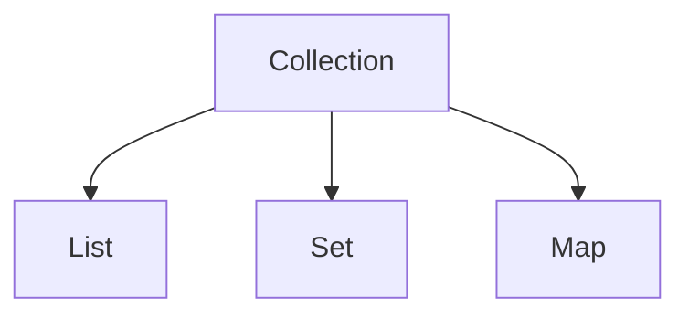

# Collection(List/Map/Set)とGenerics

## この章で学ぶこと

- Collectionとは何かを理解する
- List、Map、Setの違いを理解する
- Genericsとは何かを理解する
- TERASOLUNAでよく利用されるコレクションを理解する


## Collectionとは

Collection（コレクション）とは、複数のデータをまとめて管理するための仕組みである。

例えば、

```text
ユーザー1
ユーザー2
ユーザー3
```

を管理したい場合、

```java
User user1;
User user2;
User user3;
```

のように変数を大量に作るのは大変である。

そのためCollectionを利用する。

---

## Collectionの分類

Javaでは主に以下を利用する。



---

## List

順番を持つコレクションである。

```java
List<String> names;
```

イメージ

```text
[0] 田中
[1] 鈴木
[2] 佐藤
```

特徴

- 順番を保持する
- 同じ値を格納可能
- 最も利用頻度が高い

---

### Listの利用例

```java
List<String> users =
        new ArrayList<>();

users.add("田中");

users.add("鈴木");
```

---

## Set

重複を許可しないコレクションである。

```java
Set<String> users =
        new HashSet<>();
```

イメージ

```text
田中
鈴木
佐藤
```

特徴

- 順番を保証しない
- 重複データを保持しない

---

## Map

キーと値の組み合わせで管理するコレクションである。

```java
Map<String, String>
```

イメージ

```text
userId → U001
name   → 田中
```

特徴

- キー(Key)
- 値(Value)

の組み合わせで管理する。

---

### Mapの利用例

```java
Map<String, String> user =
        new HashMap<>();

user.put("userId", "U001");

user.put("name", "田中");
```

---

## Collectionの使い分け

|種類|順序|重複|
|---|---|---|
|List|○|○|
|Set|×|×|
|Map|キー管理|キー重複不可|

---

## Genericsとは

Generics（ジェネリクス）とは、

```text
どの型を扱うか
```

を指定する仕組みである。

例)

```java
List<String>
```

String型専用のList

---

## Genericsを利用しない場合

```java
List list =
        new ArrayList();
```

格納

```java
list.add("田中");

list.add(100);
```

異なる型が混在してしまう。

---

## Genericsを利用する場合

```java
List<String> names =
        new ArrayList<>();
```

格納

```java
