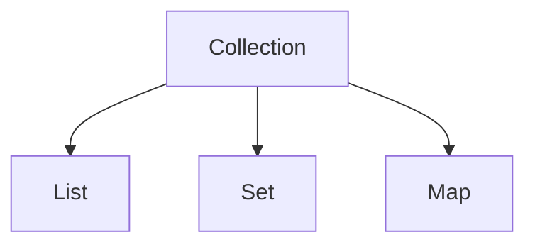

# Collection(List/Map/Set)とGenerics

## この章で学ぶこと

- Collectionとは何かを理解する
- List、Map、Setの違いを理解する
- Genericsとは何かを理解する

## Collectionとは

Collection（コレクション）とは、複数のデータをまとめて管理するための仕組みである。

例えば、

```text
ユーザ1
ユーザ2
ユーザ3
```

を管理したい場合、

```java
User user1;
User user2;
User user3;
```

のように変数を大量に作るのは大変である。

そのためCollectionを利用する。

## Collectionの分類

Javaでは主に以下を利用する。



## List

順番を持つコレクションである。

```java
List<String> names;
```

イメージ

```text
[0] 田中
[1] 鈴木
[2] 佐藤
```

特徴

- 順番を保持する
- 同じ値を格納可能
- 最も利用頻度が高い

### Listの利用例

```java
List<String> users = new ArrayList<>();

users.add("田中");

users.add("鈴木");
```

## Set

重複を許可しないコレクションである。

```java
Set<String> users = new HashSet<>();
```

イメージ

```text
田中
鈴木
佐藤
```

特徴

- 順番を保証しない
- 重複データを保持しない

## Map

キーと値の組み合わせで管理するコレクションである。

```java
Map<String, String>
```

イメージ

```text
userId → U001
name   → 田中
```

特徴

- キー(Key)
- 値(Value)

の組み合わせで管理する。

### Mapの利用例

```java
Map<String, String> user = new HashMap<>();

user.put("userId", "U001");

user.put("name", "田中");
```

## Collectionの使い分け

|種類|順序|重複|
|---|---|---|
|List|○|○|
|Set|×|×|
|Map|キー管理|キー重複不可|

## Genericsとは

Generics（ジェネリクス）とは、

```text
どの型を扱うか
```

を指定する仕組みである。

例)

```java
List<String>
```

String型専用のList

## Genericsを利用しない場合

```java
List list = new ArrayList();
```

格納

```java
list.add("田中");

list.add(100);
```

異なる型が混在してしまう。

## Genericsを利用する場合

```java
List<String> names = new ArrayList<>();
```

格納

```java
names.add("田中");

names.add("鈴木");
```

誤り

```java
names.add(100);
```

コンパイルエラーになる。

## List<User>

クラスもGenericsに指定できる。

例)

```java
List<User> users = new ArrayList<>();
```

イメージ

```text
User
├─ 田中
├─ 鈴木
└─ 佐藤
```

## なぜ<int>ではないのか

Genericsには参照型を指定する。

以下はエラーとなる。

```java
List<int>
```

正しい例

```java
List<Integer>
```

```java
List<Long>
```

```java
List<Boolean>
```

## ラッパークラス

プリミティブ型には対応するラッパークラスが存在する。

|プリミティブ型|ラッパークラス|
|---|---|
|int|Integer|
|long|Long|
|double|Double|
|boolean|Boolean|
|char|Character|

## まとめ

- Collectionは複数のデータを管理する仕組みである
- Listは順番を保持する
- Setは重複を許可しない
- Mapはキーと値で管理する
- Genericsは扱う型を指定する仕組みである


```java
List<User>
```

```java
Map<String, Object>
```

が読めれば、Javaのソースコードを理解しやすくなる。

⬅️ [前へ](./11_inheritance-and-interface.md) ➡️ [次へ](./13_control-statements.md) 🏠 [ホーム](./README.md)