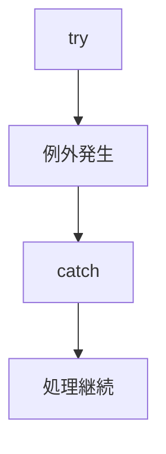

# 🚨 例外処理

## 🎯 この章で学ぶこと

- 例外とは何かを理解する
- try-catch-finallyを理解する
- throwとthrowsの違いを理解する
- Checked ExceptionとRuntimeExceptionの違いを理解する
- TERASOLUNAでの例外処理を理解する

---

## 例外とは

例外（Exception）とは、プログラム実行中に発生するエラーのことである。

例)

- ファイルが存在しない
- データベースへ接続できない
- 数値へ変換できない
- 不正な入力が行われた

---

## 例外が発生した場合

例外処理を行わない場合、プログラムは異常終了する。

例)

```java
int value = Integer.parseInt("ABC");
```

実行結果

```text
NumberFormatException
```

---

## try-catch

例外を捕捉するために利用する。

```java
try {

    int value =
        Integer.parseInt("ABC");

} catch (NumberFormatException e) {

    System.out.println("変換エラー");

}
```

実行結果

```text
変換エラー
```

---

## 処理の流れ



---

## finally

finallyは例外の有無に関係なく実行される。

例)

```java