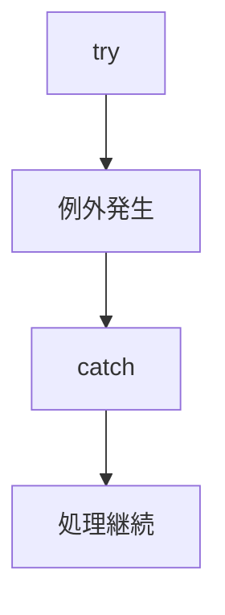
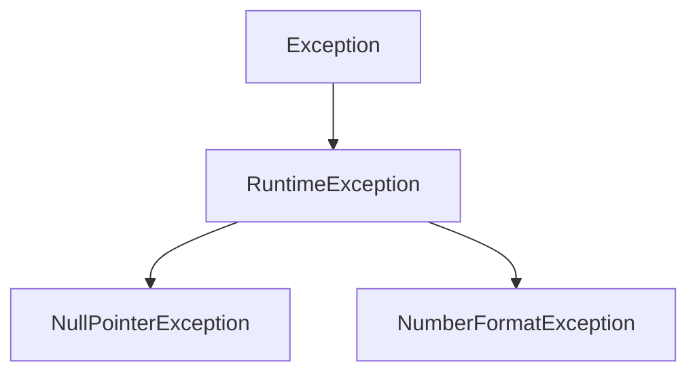

# 例外処理

## この章で学ぶこと

- 例外とは何かを理解する
- try-catch-finallyを理解する
- throwとthrowsの違いを理解する
- Checked ExceptionとRuntimeExceptionの違いを理解する

## 例外とは

例外（Exception）とは、プログラム実行中に発生するエラーのことである。

例)

- ファイルが存在しない
- データベースへ接続できない
- 数値へ変換できない
- 不正な入力が行われた

## 例外が発生した場合

例外処理を行わない場合、プログラムは異常終了する。

例)

```java
int value = Integer.parseInt("ABC");
```

実行結果

```text
NumberFormatException
```

## try-catch

例外を捕捉するために利用する。

```java
try {

    int value = Integer.parseInt("ABC");

} catch (NumberFormatException e) {

    System.out.println("変換エラー");

}
```

実行結果

```text
変換エラー
```

## 処理の流れ



## finally

finallyは例外の有無に関係なく実行される。

例)

```java
try {

    System.out.println("処理開始");

} catch (Exception e) {

    System.out.println("例外発生");

} finally {

    System.out.println("必ず実行");

}
```

利用例

- DB接続のクローズ
- ファイルクローズ
- リソース解放

## Exceptionクラス

例外はクラスとして表現される。

例)

```java
Exception
```

```java
IOException
```

```java
RuntimeException
```

```java
NumberFormatException
```

## throw

throwは例外を発生させる。

例)

```java
throw new Exception();
```

業務例

```java
if (userId == null) {

    throw new IllegalArgumentException(
        "userId is null"
    );

}
```

## throws

throwsは

```text
このメソッドは例外を発生させる可能性がある
```

ことを呼び出し元へ通知する。

例)

```java
public void execute() throws Exception {

}
```

利用側

```java
try {

    execute();

} catch (Exception e) {

}
```

## throw と throws の違い

|項目|説明|
|---|---|
|throw|例外を発生させる|
|throws|例外を通知する|

例)

```java
throw new Exception();
```

↓

```java
throws Exception
```

## Checked Exception

コンパイル時に必ず処理を要求される例外。

例)

```java
IOException
```

```java
SQLException
```

例)

```java
public void readFile() throws IOException {

}
```

呼び出し側では必ず処理が必要。

```java
try {

    readFile();

} catch (IOException e) {

}
```

## RuntimeException

実行時に発生する例外。

例)

```java
NullPointerException
```

```java
NumberFormatException
```

```java
IllegalArgumentException
```

例)

```java
String name = null;

name.length();
```

実行結果

```text
NullPointerException
```

## Exception階層



## 例外ログ

例外発生時はログを確認する。

例)

```java
catch (Exception e) {

    logger.error(
        "予期しないエラー",
        e
    );

}
```

## まとめ

- 例外はプログラム実行中のエラーである
- try-catchで例外を処理する
- finallyは必ず実行される
- throwは例外を発生させる
- throwsは例外を通知する
- RuntimeExceptionは実務でよく発生する


例外処理の基本構文

```java
try {

} catch (Exception e) {

} finally {

}
```

一般的なWebアプリケーショ開発では、

- try-catch
- throw
- RuntimeException

を頻繁に利用する。

⬅️ [前へ](./13_control-statements.md) ➡️ [次へ](./15_jar.md) 🏠 [ホーム](./README.md)