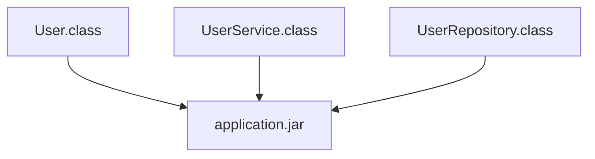
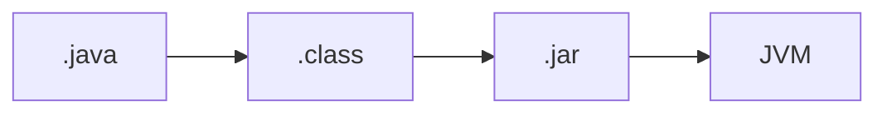
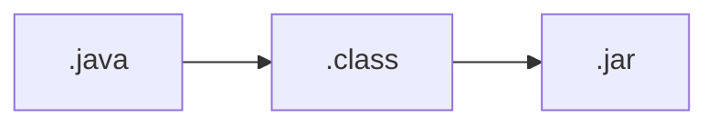

# JAR

## この章で学ぶこと

- JARとは何かを理解する
- クラスファイルとの関係を理解する
- Javaアプリケーションの配布方法を理解する
- Mavenとの関係を理解する

## JARとは

JAR（Java ARchive）とは、複数のクラスファイルや設定ファイルを1つにまとめたファイルである。

拡張子

```text
.jar
```

## なぜJARが必要なのか

Javaプログラムはコンパイルするとクラスファイル(.class)になる。

例)

```text
User.class
UserService.class
UserRepository.class
```

しかし、実際のシステムでは数百から数千のクラスが存在する。

これらを個別に配布するのは大変である。

そこでJARを利用する。

## JARのイメージ



複数のクラスファイルを1つのファイルとして管理できる。

## Javaプログラムの流れ



## JARの中身

JARはZIP形式に近い構造を持つ。

例)

```text
application.jar
│
├─ META-INF
│   └─ MANIFEST.MF
│
├─ User.class
├─ UserService.class
└─ UserRepository.class
```

## JARの作成

JDKにはjarコマンドが含まれている。

例)

```bash
jar cf sample.jar *.class
```

## JARの実行

実行可能JARの場合

```bash
java -jar sample.jar
```

で実行できる。

## ライブラリとしてのJAR

JARはアプリケーションだけでなくライブラリとしても利用される。

例)

```text
spring-core.jar
```

```text
mybatis.jar
```

```text
postgresql.jar
```

### 開発者は直接管理しない

現在の開発ではMavenがJARの管理を行う。

例)

```xml
<dependency>
    <groupId>org.springframework</groupId>
    <artifactId>spring-context</artifactId>
</dependency>
```

Mavenが必要なJARを自動的に取得する。

## JARとWARの違い

JAR

```text
Javaアプリケーション
```

をまとめるためのファイル。

WAR

```text
Webアプリケーション
```

をまとめるためのファイル。

## まとめ

- JARは複数のクラスファイルをまとめたファイルである
- 拡張子は .jar
- Javaアプリケーションの配布に利用する
- ライブラリもJAR形式で提供される
- MavenがJAR管理を行う
- WebアプリケーションではWARが利用される



これまで学習した

- クラス
- オブジェクト
- フィールド
- メソッド

などはコンパイル後にクラスファイルとなり、最終的にJARとしてまとめられる。

## Java章のまとめ

本章では以下を学習した。

- Javaとは
- Java実行の仕組み
- JDK / JRE / JVM
- パッケージとクラス
- オブジェクト指向
- 型
- クラスとオブジェクト
- フィールドとメソッド
- コンストラクタ
- アクセス修飾子
- 継承とインターフェース
- CollectionとGenerics
- 制御構文
- 例外処理
- JAR

これらはSpring FrameworkおよびTERASOLUNA Frameworkを理解するための基礎知識となる。

次章からはJava開発を進めるにあたり覚えておくべき開発ツールについて学習する。

⬅️ [前へ](./14_exception-handling.md) 🏠 [ホーム](./README.md)