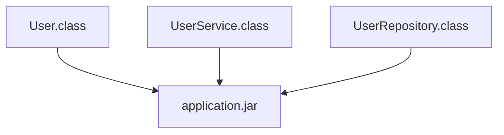

# 📦 JAR

## 🎯 この章で学ぶこと

- JARとは何かを理解する
- クラスファイルとの関係を理解する
- Javaアプリケーションの配布方法を理解する
- Mavenとの関係を理解する

---

## JARとは

JAR（Java ARchive）とは、複数のクラスファイルや設定ファイルを1つにまとめたファイルである。

拡張子

```text
.jar
```

---

## なぜJARが必要なのか

Javaプログラムはコンパイルするとクラスファイル(.class)になる。

例)

```text
User.class
UserService.class
UserRepository.class
```

しかし、実際のシステムでは数百から数千のクラスが存在する。

これらを個別に配布するのは大変である。

そこでJARを利用する。

---

## JARのイメージ



複数のクラスファイルを1つのファイルとして管理できる。

---

## Javaプログラムの流れ

```mermaid
flowchart LR

    JAVA[".java"]

    CLASS