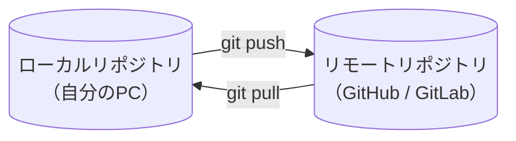
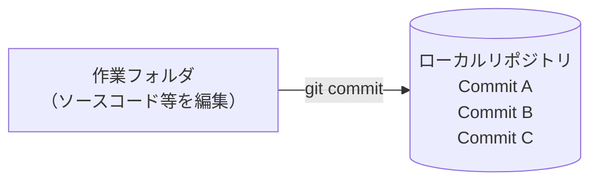
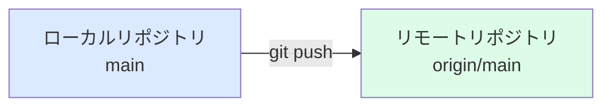
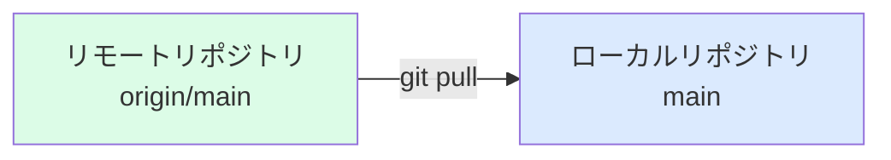
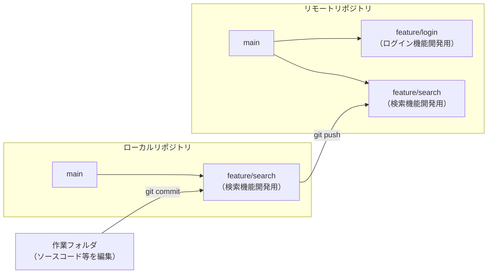
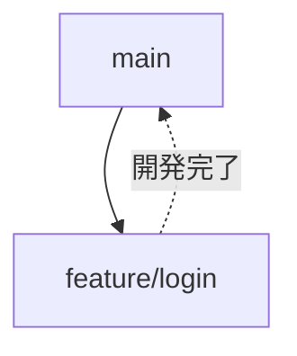
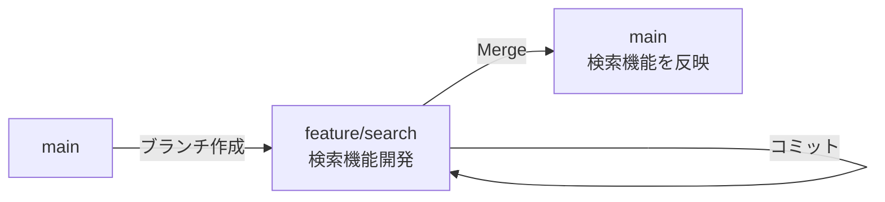
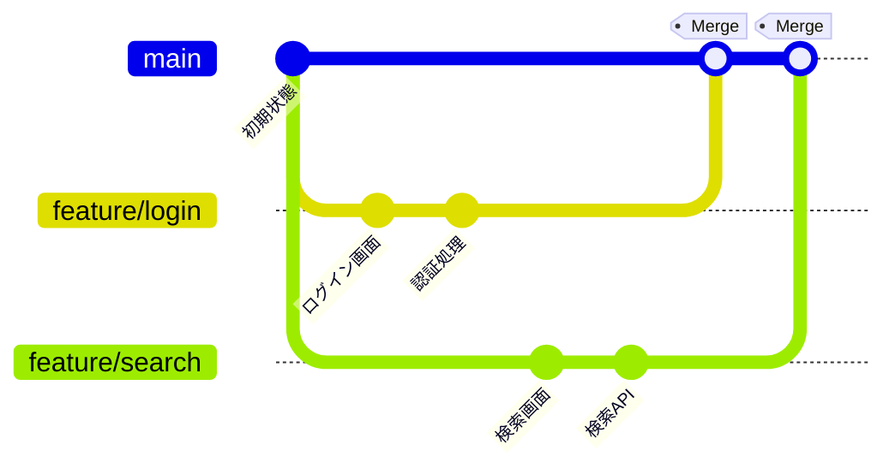

# Gitの基礎知識

## Gitとは

Gitはソースコードやドキュメントの変更履歴を管理するためのバージョン管理システムです。

主な目的は以下の通りです。

- 変更履歴を記録する
- 過去の状態へ戻す
- 複数人で安全に開発する
- 変更内容を比較する
- ソースコードを共有する

## Gitのメリット

### 履歴管理

いつ、誰が、何を変更したかを記録できます。

### バックアップ

GitHubなどのリモートリポジトリに保存することでバックアップとして利用できます。

### 複数人開発

複数人が同じプロジェクトを同時に開発できます。

### ブランチ機能

機能開発や不具合修正を別作業として管理できます。

## Gitの基本概念

### リポジトリ（Repository）

Gitでは、ソースコードを「リポジトリ」と呼ばれる場所で管理します。

リポジトリには以下の2種類があります。

#### ローカルリポジトリ

自分のPC上に存在するリポジトリとなり、開発やコミットを行う場所

#### リモートリポジトリ

GitHubやGitLabなどのサーバ上に存在するリポジトリとなり、チームでソースコードを共有する場所



### コミット（Commit）

コミットとは、変更したファイルの状態をローカルリポジトリへ記録する操作です。

コミットすると、その時点の変更内容が履歴として保存されます。

保存された履歴は後から参照できるため、過去の状態を確認したり、問題発生時に以前の状態へ戻したりできます。 

コミットは、ゲームにおける「セーブポイント」のようなものです。



※コミットしただけでは他のメンバーには共有されません。

変更内容をチームに共有するには、「Push」を実行してリモートリポジトリへ反映する必要があります。


### Push

git push は、ローカルリポジトリの変更をリモートリポジトリへ送信するコマンドです。

ローカルで作業した内容は、git add → git commit を実行しただけでは自分のPC内にしか保存されていません。

git pushを実行することで、コミット履歴が GitHub / GitLab などのリモートリポジトリへ反映され、他のメンバーも参照できるようになります。



コマンド実行例：
```PowerShell
git push origin main
```

origin : リモートリポジトリ名

main : 反映先ブランチ


### Pull

git pull は、リモートリポジトリの最新状態をローカルリポジトリへ取り込むコマンドです。

複数人で開発している場合、他のメンバーがリモートリポジトリへ変更を反映していることがあります。

その状態で作業を始めると、古いコードを基に開発してしまう可能性があります。

そのため、作業開始前やプッシュ前には git pull を実行し、最新状態を取得することが推奨されます。



### ブランチ（Branch）

複数人で開発を行う場合、全員が同じ場所で直接作業すると、お互いの変更が影響し合い、問題が発生しやすくなります。

そこでGitでは、ブランチ（作業用の分岐） を作成して開発を行います。

ブランチを利用することで、他の人の作業に影響を与えることなく、機能追加や不具合修正を進められます。

ブランチはローカルリポジトリおよびリモートリポジトリの両方に存在します。

通常はローカルリポジトリでブランチを作成して開発を行い、完成後にリモートリポジトリへ Push します。

ブランチの例： ローカルで検索機能を開発する場合
|ブランチ|説明|
|---|---|
|main|本番リリース対象のコード|
|feature/login|ログイン機能開発用ブランチ|
|feature/search|検索機能開発用ブランチ|

検索機能を開発する場合、main から feature/search ブランチを作成し、feature/search ブランチ上でコミットを行う。開発した内容は git push によりリモートリポジトリの feature/search ブランチへ反映する。



メリット：

- 他人の作業に影響を与えない
- 機能ごとに開発できる
- 安全に実験できる
- レビュー後に main へ取り込める

ブランチ利用時の注意点：

- ブランチを長期間放置すると、取り込み時の競合（コンフリクト）が発生しやすくなる
- ブランチを増やしすぎると管理が煩雑になる
- main の変更を定期的に取り込まないと差分が大きくなる

ブランチの代表的な分け方：

| ブランチ種別 | 用途         | 例                  |
| ------ | ---------- | ------------------ |
| 機能追加   | 新しい機能を開発する | feature/login      |
| 不具合修正  | バグを修正する    | fix/login-error    |
| 緊急修正   | 本番障害を修正する  | hotfix/issue-001   |
| 調査・検証  | 動作確認やPoC   | experiment/new-api |

Gitではブランチ作成・削除が非常に軽量なので、機能追加や不具合修正などの作業単位ごとにブランチを作成して開発することが一般的です。


### マージ（Merge）

マージとは、ブランチで行った変更を別のブランチへ統合する操作です。

ブランチは他の開発者に影響を与えず安全に開発するために作成しますが、開発が完了したらその変更を本番リリース対象の main ブランチへ反映する必要があります。

そのために行うのがマージです。



※複数人が同じ箇所を変更している場合、マージ時に競合（コンフリクト）が発生することがあります。

#### なぜマージが必要なのか

ブランチを作成しただけでは、そのブランチ内の変更は他の開発者や本番環境には反映されません。

例えばあるメンバが検索機能を開発した場合、commit/pushした状態では、検索機能は main ブランチには存在せず、feature/search ブランチにしか存在しません。

そのため、開発完了後は main へ変更を取り込む必要があります。



複数メンバで複数ブランチを作成し、マージしていくイメージは以下の通りです。



#### 誰がマージするのか

プロジェクトによって運用は異なります。

| 開発規模 | マージ方法 |
| --- | --- |
| 小規模開発 | 開発者自身がマージすることが多い |
| チーム開発（一般的） | 開発担当者がマージリクエスト（Pull Request / Merge Request）を作成し、コードレビューや承認後にマージする |

※マージ前にコードレビューを行うことで、不具合や品質上の問題を事前に発見できます。

#### コンフリクトとは

複数人が同じ箇所を変更した場合、Git がどちらの変更を採用すべきか判断できなくなることがあります。

##### コンフリクトが発生しにくくするコツ

1. ブランチを長期間放置しない
2. main の変更を定期的に取り込む
3. 同じファイル・同じ箇所を複数人で同時に変更しない


## Gitの管理イメージ

Gitではファイルが以下の状態で管理されます。

```text
作業ディレクトリ
      ↓
   git add
      ↓
ステージングエリア
      ↓
 git commit
      ↓
ローカルリポジトリ
      ↓
  git push
      ↓
リモートリポジトリ
```

### .gitignore作成

Java/Mavenプロジェクトの場合

```gitignore
target/
.idea/
.vscode/
*.iml
.classpath
.project
.settings*
```


## よく利用するコマンド

### 状態確認

```bash
git status
```

現在の変更状況を確認できます。


### リポジトリ初期化

```bash
git init
```

現在のディレクトリをGit管理対象にします。


### ファイル追加

特定ファイル

```bash
git add sample.txt
```

全ファイル

```bash
git add .
```

### コミット

```bash
git commit -m "初回コミット"
```

変更履歴を保存します。


### 履歴確認

簡易表示

```bash
git log --oneline
```

詳細表示

```bash
git log
```


### 変更内容確認

未コミットの変更確認

```bash
git diff
```

### リモートリポジトリ登録

```bash
git remote add origin <リポジトリURL>
```

確認

```bash
git remote -v
```


### Push

初回

```bash
git push -u origin main
```

2回目以降

```bash
git push
```

### Pull

```bash
git pull
```

最新状態を取得します。


## ブランチ操作

### ブランチ一覧

```bash
git branch
```

### ブランチ作成

```bash
git branch feature/login
```

### ブランチ切替

```bash
git checkout feature/login
```

### ブランチ作成＋切替

```bash
git checkout -b feature/login
```

## 最新の書き方

```bash
git switch -c feature/login
```

### マージ

mainブランチで実行

```bash
git merge feature/login
```


## コンフリクト

同じ箇所を複数人が変更した場合に発生します。

例

```text
<<<<<<< HEAD
こんにちは
=======
Hello
>>>>>>> feature/login
```

手動で修正後

```bash
git add .
git commit
```

を実行します。


## よくある開発の流れ

### 1. 最新取得

```bash
git pull
```

### 2. ブランチ作成

```bash
git switch -c feature/login
```

### 3. 開発

ソースコードを修正


### 4. 変更確認

```bash
git status
```

### 5. ステージング

```bash
git add .
```

### 6. コミット

```bash
git commit -m "ログイン機能追加"
```

### 7. Push

```bash
git push origin feature/login
```

### 8. Pull Request作成

GitHub上でレビュー依頼を行う

### 9. マージ

レビュー完了後にmainブランチへ統合

## よく使うコマンド一覧

| 操作 | コマンド |
|--------|----------|
| 状態確認 | `git status` |
| ファイル追加 | `git add .` |
| コミット | `git commit -m "message"` |
| 履歴確認 | `git log --oneline` |
| 変更確認 | `git diff` |
| ブランチ一覧 | `git branch` |
| ブランチ作成 | `git switch -c branch-name` |
| ブランチ切替 | `git switch branch-name` |
| マージ | `git merge branch-name` |
| Push | `git push` |
| Pull | `git pull` |


## まとめ

- Gitは変更履歴を管理するためのツール
- コミットによって変更履歴を保存する
- ブランチを利用して安全に開発する
- Pushで共有し、Pullで最新状態を取得する
- 日常業務では `status`、`add`、`commit`、`push`、`pull` を最もよく利用する


