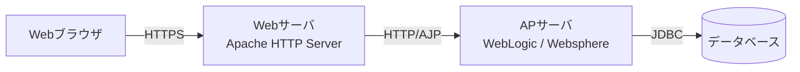
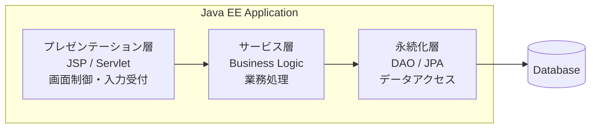

# Java EE Webアプリケーションアーキテクチャ概要

本書では、Java EEベースのWebアプリケーションにおけるシステム構成、アプリケーションアーキテクチャ、および各レイヤの役割について説明する。

Java EEの標準コンポーネントを利用したWebアプリケーションは、ブラウザ、Webサーバ、アプリケーションサーバ、およびデータベースによって構成される。アプリケーション内部では、プレゼンテーション層、サービス層、永続化層の多層構造を採用し、それぞれの責務を明確に分離している。

## 2. システム全体構成

Java EEベースのWebアプリケーションは、Webブラウザ、Webサーバ、APサーバ、およびデータベースによって構成される。

利用者からのHTTPリクエストはWebブラウザから送信され、Webサーバを経由してAPサーバで処理される。

APサーバは必要に応じてデータベースへアクセスし、処理結果をWebブラウザへ返却する。

### 構成要素

| コンポーネント | 役割 |
| ---------- | ---------- |
| Webブラウザ | ユーザインターフェース |
| Webサーバ | 静的コンテンツ配信・リバースプロキシ |
| APサーバ | 業務処理実行 |
| データベース | データ永続化 |

## 3. アプリケーションアーキテクチャ

前章では、Webブラウザ、Webサーバ、APサーバ、データベースといったシステム全体の構成要素とその接続関係について説明した。

本章では、APサーバ上で動作するJava EEアプリケーションの内部構造について説明する。

Java EEベースのWebアプリケーションでは、責務を明確に分離するためにプレゼンテーション層、サービス層、永続化層から構成される多層アーキテクチャを採用することが一般的である。各レイヤはそれぞれ独立した役割を持ち、上位レイヤから下位レイヤへ処理を委譲することで、保守性および拡張性の高い構造を実現している。

## 4. レイヤ責務

Java EEアプリケーションでは、システムの責務を分離するために多層アーキテクチャを採用することが一般的である。

各レイヤは独立した役割を持ち、上位レイヤは下位レイヤの機能を利用する構造となる。

この責務分離により、機能追加や仕様変更の影響範囲を限定できるほか、保守性や再利用性の向上を実現できる。

### 4.1 プレゼンテーション層

プレゼンテーション層は、利用者とのインタフェースを提供するレイヤである。

Webブラウザからのリクエストを受け付け、画面表示や入力データの受け渡しを行う。

また、入力値の妥当性チェックや画面遷移制御など、ユーザー操作に直接関係する処理を担当する。

業務ロジックやデータアクセス処理は保持せず、必要な処理をサービス層へ委譲することで責務を明確にしている。

#### 利用技術

| 技術 | 説明 |
|--------|--------|
| Servlet（Java Servlet） | ブラウザからのリクエストを受け付け、適切な処理へ振り分けるコントローラとして機能する。 |
| JSP（JavaServer Pages） | サーバサイドで画面を生成し、HTMLとしてブラウザへ返却する。 |
| Filter（Servlet Filter） | 認証チェックやログ出力など、リクエスト・レスポンス共通処理を実装する。 |

#### 主な役割

- リクエスト受付
- 入力チェック
- 画面制御
- レスポンス返却

### 4.2 サービス層

サービス層は、アプリケーションの中心となる業務ロジックを実装するレイヤである。

プレゼンテーション層から受け取った要求に対して、業務ルールに基づく処理を実行する。

複数のデータ取得や更新処理を組み合わせた処理や、トランザクション管理が必要となる処理は主にこのレイヤで実装される。

業務知識を集約することで、画面やデータベースの変更から業務ロジックを独立させる役割も担う。

#### 利用技術

| 技術 | 説明 |
|--------|--------|
| Serviceクラス | アプリケーション固有の業務ロジックを実装する。 |
| EJB（Enterprise JavaBeans） | トランザクション管理やコンテナサービスを利用するためのJava EEコンポーネントである。 |
| CDI（Contexts and Dependency Injection） | オブジェクトの生成や依存関係の注入を管理し、コンポーネント間の結合度を低減する。 |

#### 主な役割

- 業務ルール実装
- トランザクション制御
- データ整形
- 外部サービス連携

### 4.3 永続化層

永続化層は、データベースとのアクセスを担当するレイヤである。

サービス層からの要求に応じてデータの検索、登録、更新、削除を実行する。

SQLやデータベース固有の処理をこのレイヤに集約することで、上位レイヤがデータベースの実装詳細を意識する必要がなくなる。

また、JPAを利用することでオブジェクトとテーブルのマッピングを行い、効率的かつ保守性の高いデータアクセスを実現する。

#### 利用技術

| 技術 | 説明 |
|--------|--------|
| DA（Data Access Object） | データベースアクセス処理を集約するクラスである。 |
| JPA（Java Persistence API） | オブジェクトとデータベーステーブルのマッピングを提供するJava EE標準仕様である。 |
| EntityManager（JPA EntityManager） | JPAを利用してエンティティの取得や永続化を行う。 |
| Entity（JPA Entity） | データベーステーブルに対応するオブジェクトである。 |

#### 主な役割

- データ取得
- データ登録
- データ更新
- データ削除

> [!NOTE]
> ### Coffee Break: Beanとコンテナとは？
>
> Java EEでは「Bean」や「コンテナ」という言葉が頻繁に登場する。
>
> Beanとは、アプリケーションを構成するJavaオブジェクトのことである。例えば、利用者情報を検索するサービスや、データベースへアクセスする処理など、業務機能を実装したクラスから生成されたオブジェクトがBeanとして扱われる。
>
> 通常のJavaプログラムでは、開発者が `new` を利用してオブジェクトを生成し、そのライフサイクルを管理する。一方、Java EEではアプリケーションサーバがオブジェクトの生成や破棄、依存関係の解決などを管理する。
>
> この管理機能を提供する仕組みを「コンテナ」と呼ぶ。
>
> Java EEには用途に応じて複数のコンテナが存在する。例えば、Servletを管理するServletコンテナや、Bean同士の依存関係を管理するDI（Dependency Injection）コンテナなどがある。
>
> 開発者はコンテナが提供する機能を利用することで、オブジェクト管理や共通処理の実装を意識する必要がなくなり、業務ロジックの開発に集中できる。

