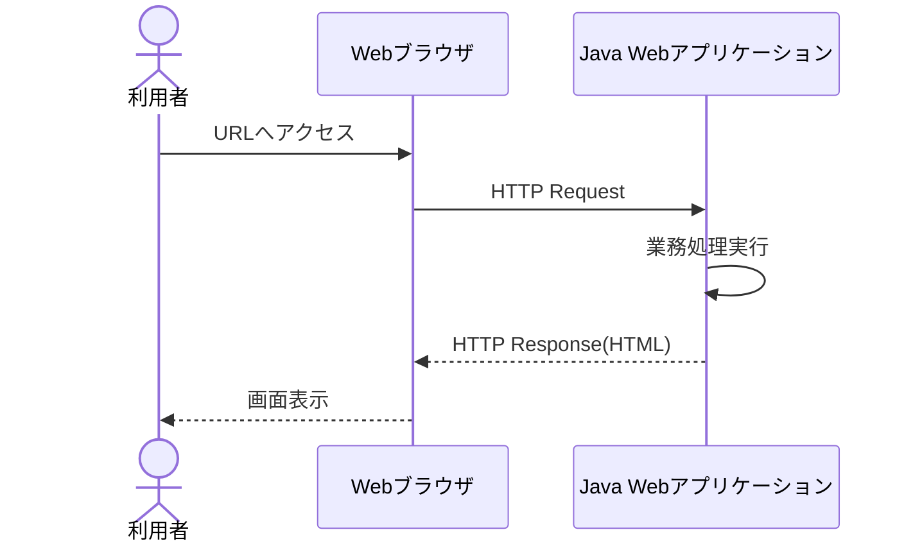
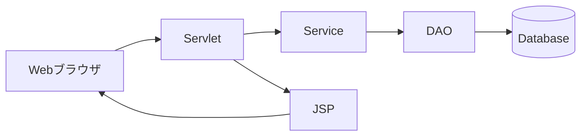
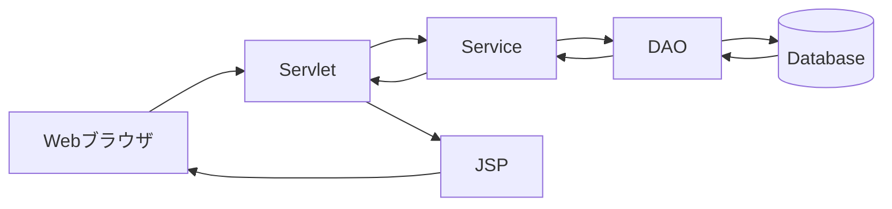

# Java Webアプリケーション

## 1. 概要

前章では、Webアプリケーション全体のシステム構成およびアプリケーションアーキテクチャについて説明した。

本章では、Java Webアプリケーションがどのようにリクエストを受け取り、処理結果を利用者へ返却するのかについて説明する。

Java Webアプリケーションは、Webブラウザから送信されたHTTPリクエストを受け取り、業務処理を実行した後にレスポンスを生成して利用者へ返却する。

# 2. Java Webアプリケーションの処理イメージ

利用者がURLへアクセスすると、リクエストはWebサーバを経由してJava Webアプリケーションへ到達する。

Java Webアプリケーションはリクエスト内容に応じた処理を実行し、その結果をHTMLとして生成してブラウザへ返却する。

# 3. Java Webアプリケーションを構成する要素

Java Webアプリケーションは複数のコンポーネントによって構成される。

| 要素 | 役割 |
|--------|--------|
| Servlet | リクエストの受付および処理制御 |
| JSP | 画面生成 |
| Service | 業務ロジック実装 |
| DAO | データベースアクセス |
| Database | データの永続化 |

# 4. リクエストからレスポンスまでの流れ

利用者からのリクエストは、複数のコンポーネントを経由しながら処理される。

一般的な処理の流れは以下の通りである。

### 処理概要

1. ブラウザからリクエストを送信する
2. Servletがリクエストを受け付ける
3. Serviceが業務処理を実行する
4. DAOがデータベースへアクセスする
5. Serviceが処理結果を作成する
6. JSPがHTMLを生成する
7. ブラウザへレスポンスを返却する

> [!NOTE]
> ### Coffee Break: サーバサイドとは？
>
> Java Webアプリケーションは「サーバサイドアプリケーション」と呼ばれる。
>
> サーバサイドとは、利用者のPCではなくサーバ上で処理を実行する方式を指す。
>
> 利用者はブラウザを操作するだけであり、実際の業務処理やデータベースアクセスはサーバ側で実行される。
>
> そのため、利用者のPCに業務プログラムをインストールする必要がなく、一元的な運用管理が可能になる。
