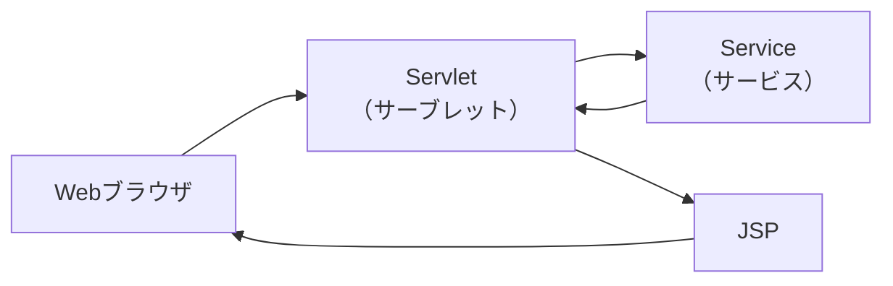
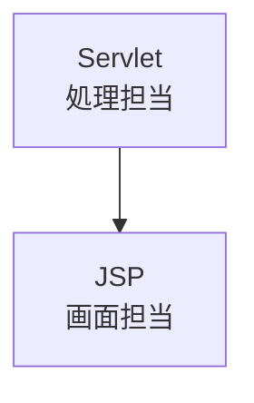

# ServletとJSP

## 1. 概要

前章では、Java Webアプリケーションがブラウザからのリクエストを受け取り、処理結果を利用者へ返却する流れについて説明した。

本章では、Java Webアプリケーションにおいて中心的な役割を担うServletおよびJSPについて説明する。

ServletとJSPは、それぞれ異なる役割を持つコンポーネントであり、連携してWebアプリケーションを実現している。

## 2. Servletとは

Servlet（Java Servlet）は、Webブラウザから送信されたHTTPリクエストを受け付け、必要な処理を実行するサーバサイドコンポーネントである。

リクエスト内容の取得や業務処理の呼び出し、画面へ渡すデータの準備などを担当する。

### 主な役割

- リクエスト受付
- パラメータ取得
- 入力値検証
- 業務処理呼び出し
- 画面遷移制御

## 3. JSPとは

JSP（JavaServer Pages）は、画面表示を行うためのサーバサイド技術である。

Servletから受け取ったデータを利用してHTMLを生成し、Webブラウザへ返却する。

### 主な役割

- HTML生成
- 画面表示
- データ表示
- レイアウト管理

## 4. ServletとJSPの関係

ServletとJSPはそれぞれ異なる責務を持っている。

Servletは「処理」を担当し、JSPは「画面表示」を担当する。

### 処理の流れ

1. ブラウザからリクエストを送信する
2. Servletがリクエストを受け付ける
3. Serviceで業務処理を実行する
4. Servletが画面へ表示するデータを準備する
5. JSPがHTMLを生成する
6. ブラウザへレスポンスを返却する

## 5. Servletでできること

代表的な機能は以下の通りである。

| 機能 | 説明 |
|--------|--------|
| パラメータ取得 | リクエストパラメータを取得する |
| セッション管理 | ログイン情報などを保持する |
| Cookie操作 | ブラウザに情報を保存する |
| 画面遷移 | JSPへの遷移を制御する |
| 業務処理呼び出し | Serviceクラスを実行する |

## 6. JSPでできること

代表的な機能は以下の通りである。

| 機能 | 説明 |
|--------|--------|
| HTML生成 | 画面を生成する |
| データ表示 | Servletから受け取った値を表示する |
| 条件分岐 | 条件によって表示内容を変更する |
| 繰り返し表示 | 一覧データを表示する |
| 共通部品化 | ヘッダやフッタを共通化する |

> [!NOTE]
> ### Coffee Break: JSPも実はServlet
>
> JSPとServletは別の技術に見えるが、実行時にはJSPもServletへ変換されて動作する。
>
> 開発者はHTMLを中心に記述できるため画面開発が容易になるが、APサーバ内部ではServletとしてコンパイルされ実行される。
>
> つまり、
>
> - Servlet = Java中心で記述する
> - JSP = HTML中心で記述する
>
> という違いはあるものの、最終的にはどちらもJavaとして実行される。

## 7. なぜServletとJSPを分けるのか

Servletだけでも画面を生成することは可能である。

しかし、HTMLをJavaコードで直接生成すると可読性や保守性が低下する。

一方でJSPだけでは業務処理を適切に管理することが難しい。

そのため、

- Servlet：処理担当
- JSP：画面担当

として役割を分離することで、保守しやすいアプリケーションを実現している。

## 8. 次章へのつながり

ServletとJSPはそれぞれ異なる責務を持ちながら連携して動作する。

この「処理を担当するコンポーネント」と「画面を担当するコンポーネント」を分離する考え方は、MVC（Model-View-Controller）アーキテクチャの基本となる。

次章では、Java Webアプリケーションで広く利用されているMVCについて説明する。
