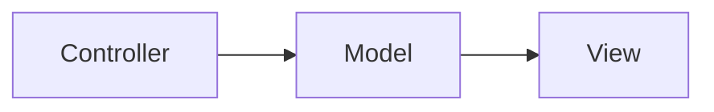
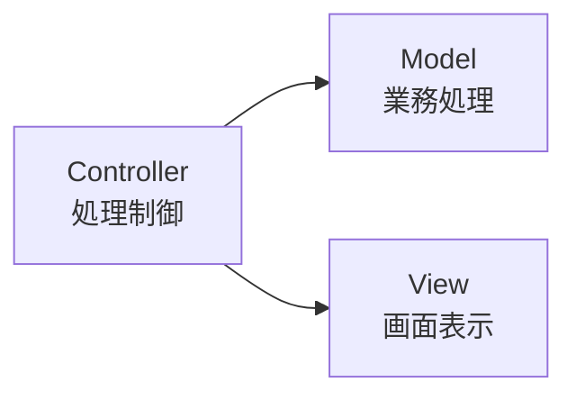
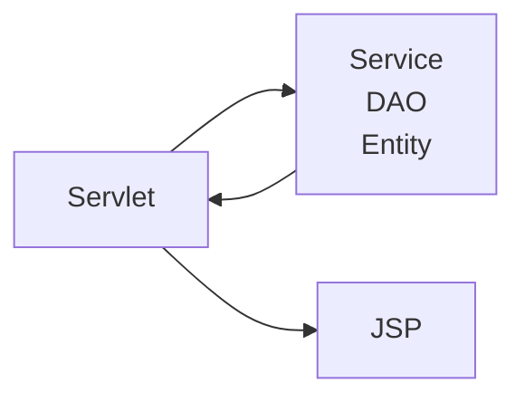
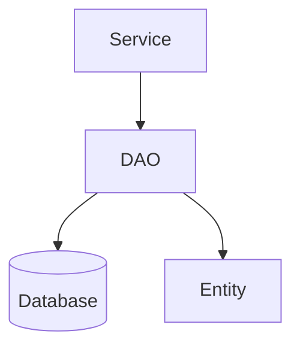
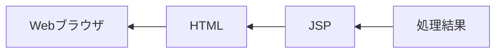
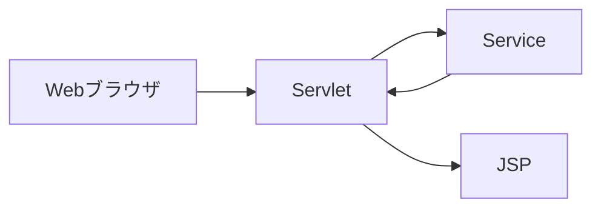
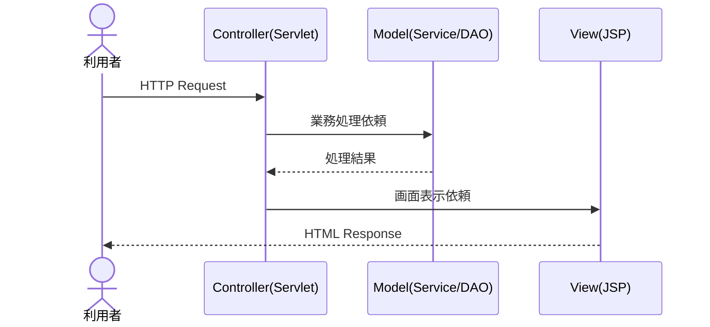
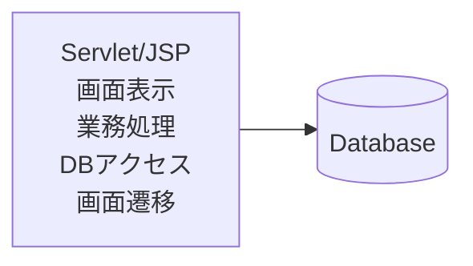

# MVC

## 1. 概要

前章では、Java Webアプリケーションを構成するServletとJSPについて説明した。

Servletはリクエストの受付や処理制御を担当し、JSPは画面表示を担当する。

このように役割を分離して開発する考え方を体系化した設計パターンがMVC（Model-View-Controller）である。

本章では、Java Webアプリケーションで広く採用されているMVCアーキテクチャについて説明する。

## 2. MVCとは

MVC（Model-View-Controller）とは、アプリケーションの責務を3つの役割に分割する設計パターンである。

画面表示、処理制御、業務ロジックを分離することで、保守性や拡張性の高いシステムを実現できる。

## 3. MVCを構成する要素

MVCは以下の3つの要素で構成される。

| 要素 | 役割 |
|--------|--------|
| Model | 業務ロジックやデータ処理を担当する |
| View | 画面表示を担当する |
| Controller | リクエスト受付や画面遷移制御を担当する |

## 4. Java WebアプリケーションにおけるMVC

Java Webアプリケーションでは、ServletとJSPを利用してMVCを実現することが一般的である。

| MVC | Java Webアプリケーション |
|--------|--------|
| Model | Service、DAO、Entity |
| View | JSP |
| Controller | Servlet |

## 5. Model

Modelは業務ロジックやデータ処理を担当する。

例えば以下のような処理はModelに実装される。

- 会員情報取得
- 注文金額計算
- 在庫確認
- ポイント計算
- データベース操作

### Modelの責務

- 業務ルールの実装
- データ加工
- データベースアクセス
- 外部システム連携

## 6. View

Viewは利用者へ画面を表示する役割を担当する。

Java Webアプリケーションでは主にJSPが利用される。

### Viewの責務

- HTML生成
- データ表示
- レイアウト管理
- 画面描画

### Viewが持つべきでない責務

- 業務ロジック
- SQL実行
- データベースアクセス

## 7. Controller

Controllerは利用者からのリクエストを受け取り、適切な業務処理と画面表示を制御する。

Java Webアプリケーションでは主にServletが担当する。

### Controllerの責務

- リクエスト受付
- 入力値取得
- 業務処理呼び出し
- 画面遷移制御
- Viewへのデータ受け渡し

## 8. MVCでの処理の流れ

利用者が画面へアクセスした場合の処理の流れを示す。

## 9. MVCのメリット

MVCを採用することで、各コンポーネントの責務を明確に分離できる。

### メリット

- 保守性が向上する
- 再利用性が向上する
- テストしやすくなる
- 役割分担が明確になる
- 機能追加が容易になる

## 10. MVCを採用しない場合

すべての処理をJSPやServletへ記述すると、業務ロジックと画面表示が混在する。

このような構造では、機能追加や修正時の影響範囲が大きくなり、保守が困難になる。

> [!NOTE]
> ### Coffee Break: MVCはJava以外でも使われる
>
> MVCはJava特有の考え方ではなく、多くのWebフレームワークで採用されている。
>
> 例えば以下のようなフレームワークでもMVCの考え方が利用されている。
>
> - Spring MVC
> - ASP.NET MVC
> - Ruby on Rails
> - Laravel
>
> フレームワークごとに名称や実装方法は異なるが、「画面」「処理制御」「業務ロジック」を分離するという考え方は共通している。

## 11. まとめ

MVCは、アプリケーションをModel、View、Controllerの3つの役割に分割する設計パターンである。

Java Webアプリケーションでは、一般的にServletがController、JSPがView、ServiceやDAOがModelを担当する。

責務を明確に分離することで、保守性・拡張性・再利用性の高いアプリケーションを実現できる。