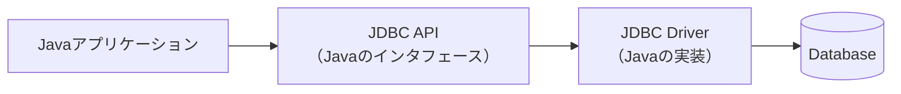
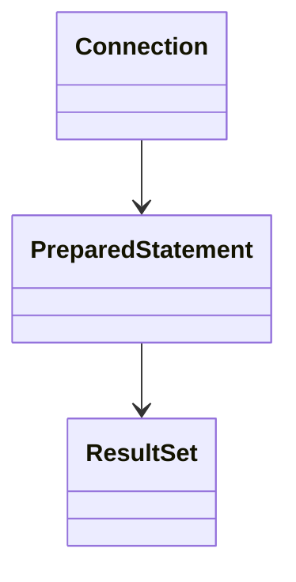
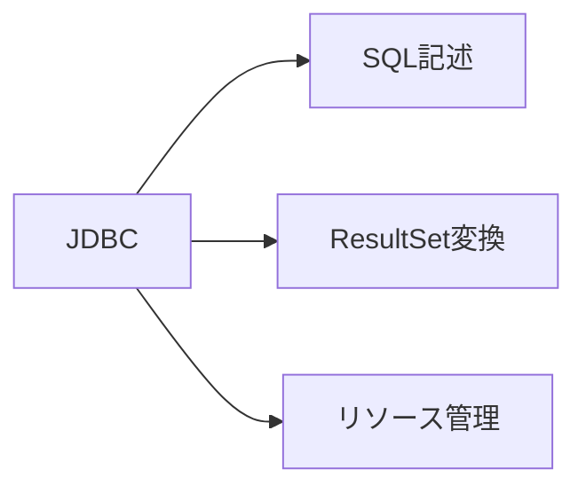
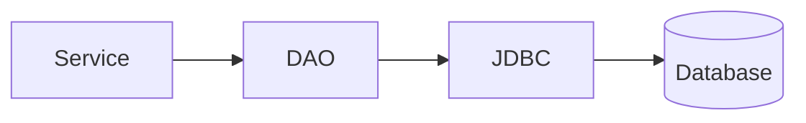
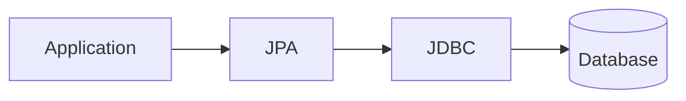

# JDBCの基礎

## 1. 概要

これまでの章では、Java Webアプリケーションの構造やMVCアーキテクチャについて説明した。

本章では、Javaアプリケーションがデータベースへアクセスするための仕組みであるJDBCについて説明する。

JDBCを利用することで、JavaプログラムはSQLを実行し、データベースに保存されたデータの取得や更新を行うことができる。

## 2. JDBCとは

JDBC（Java Database Connectivity）は、Javaからデータベースへアクセスするための標準APIである。

JavaアプリケーションはJDBCを利用することで、異なるデータベース製品に対して共通的な方法でSQLを実行できる。



## 3. JDBCの役割

JDBCは、Javaアプリケーションとデータベースの橋渡しを行う。

例えば以下のような処理を実現できる。

- データ検索（SELECT）
- データ登録（INSERT）
- データ更新（UPDATE）
- データ削除（DELETE）

## 4. JDBCを利用した処理の流れ

Javaアプリケーションがデータベースへアクセスする場合、一般的に以下の手順で処理が行われる。


### 処理概要

| 手順 | 内容 |
|--------|--------|
| 1 | データベースとの接続を取得する |
| 2 | SQLを実行する |
| 3 | 実行結果を取得する |
| 4 | 接続を解放する |

## 5. JDBCの主要インタフェース

JDBCには複数の重要なインタフェースが存在する。



| インタフェース | 役割 |
|--------|--------|
| Connection | データベースとの接続を表す |
| PreparedStatement | SQLを実行する |
| ResultSet | 検索結果を保持する |

## 6. JDBCサンプル

利用者情報を取得する簡単な例を示す。

```java
String sql =
    "SELECT user_id, user_name " +
    "FROM users " +
    "WHERE user_id = ?";

try (
    Connection conn = dataSource.getConnection();
    PreparedStatement ps =
        conn.prepareStatement(sql)
) {

    ps.setLong(1, 1L);

    ResultSet rs = ps.executeQuery();

    while (rs.next()) {

        Long id =
            rs.getLong("user_id");

        String name =
            rs.getString("user_name");

        System.out.println(name);
    }
}
```

### コードのポイント

| コード | 説明 |
|--------|--------|
| Connection | データベース接続を取得する |
| PreparedStatement | SQLを実行するためのオブジェクト |
| executeQuery() | SELECT文を実行する |
| ResultSet | 検索結果を取得する |
| rs.next() | 次のレコードへ移動する |
| getString() | カラム値を取得する |

> [!NOTE]
> ### Coffee Break: なぜPreparedStatementを使うのか？
>
> SQLを文字列連結で組み立てることも可能である。
>
> しかし、文字列連結によるSQL生成はSQLインジェクションと呼ばれるセキュリティ問題を引き起こす可能性がある。
>
> PreparedStatementを利用することで、パラメータとSQLを分離して扱うことができ、安全にSQLを実行できる。
>
> 現在のJavaアプリケーションではPreparedStatementの利用が基本となる。

## 7. JDBC利用時の課題

JDBCはシンプルで強力な仕組みである一方で、コード量が多くなりやすい。

例えば以下のような処理を毎回実装する必要がある。

- Connection取得
- SQL作成
- PreparedStatement生成
- ResultSet取得
- オブジェクト変換
- Connection解放



## 8. DAOとの関係

一般的なJavaアプリケーションでは、JDBCの処理をDAO（Data Access Object）へ集約する。



DAOを利用することで、データベースアクセス処理を一箇所に集約できる。

## 9. JDBCとJPA

JDBCはSQLを直接実行する仕組みである。

一方、JPAはオブジェクトとデータベースをマッピングする仕組みであり、内部ではJDBCを利用してデータベースへアクセスする。



## 10. まとめ

JDBCは、Javaアプリケーションがデータベースへアクセスするための標準APIである。

JDBCを利用することで、SQLを実行してデータの取得や更新を行うことができる。一方で、SQL実行やリソース管理などの実装が必要となるため、大規模なアプリケーションではDAOやJPAと組み合わせて利用されることが一般的である。

次章では、JDBCを利用したデータアクセス処理を集約するDAOパターンについて説明する。