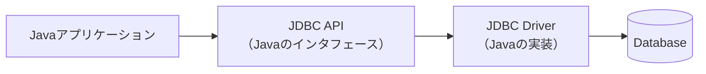
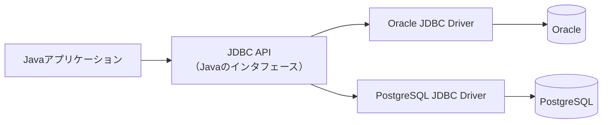
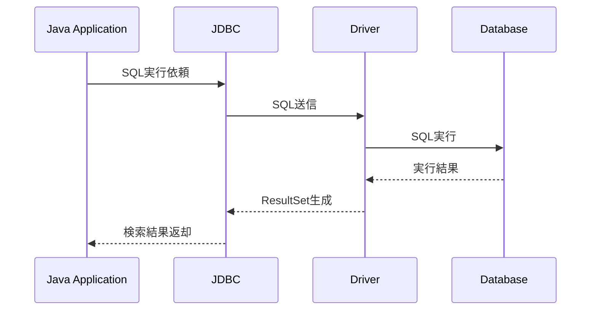
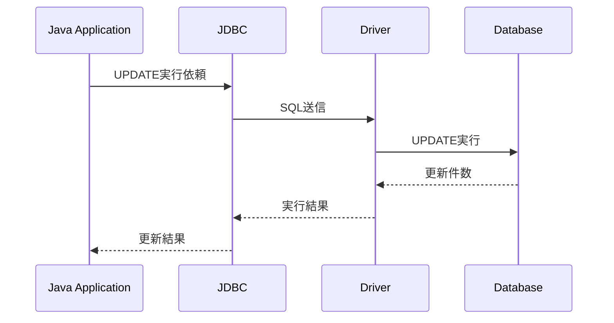
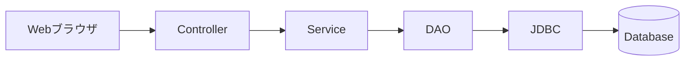
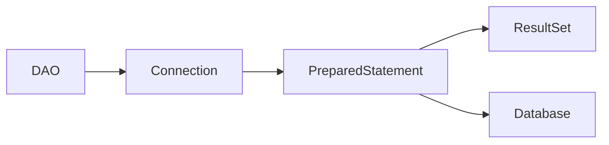

# Javaアプリケーションとデータベースの連携

## 1. 概要

前章では、Javaからデータベースへアクセスするための標準APIであるJDBCについて説明した。

本章では、Javaアプリケーションがどのようにデータベースと連携しているのか、その全体的な仕組みについて説明する。

Javaアプリケーションはデータベースへ直接アクセスしているわけではなく、JDBCおよびJDBCドライバを介してSQLを実行している。

## 2. データベース連携の全体像

Javaアプリケーションとデータベースの間には、JDBCとJDBCドライバが存在する。

### 各要素の役割

| 要素 | 役割 |
|--------|--------|
| Javaアプリケーション | 業務処理を実行する |
| JDBC | Java標準のデータベースアクセスAPI |
| JDBC Driver | データベース製品固有の通信を担当する |
| Database | データの保存および管理を行う |

## 3. なぜJDBCドライバが必要なのか

データベース製品ごとに通信方法や内部仕様は異なる。

例えば、OracleとPostgreSQLでは内部実装が異なるため、Javaアプリケーションが直接通信することはできない。

そのため、各データベース専用のJDBCドライバが仲介役となる。

> [!NOTE]
> ### Coffee Break: JDBCドライバは通訳のような存在
>
> JavaアプリケーションはJDBCという共通言語でデータベースへアクセスする。
>
> JDBCドライバは、その命令を各データベースが理解できる形式へ変換する通訳のような役割を担う。
>
> そのため、アプリケーション側は同じJDBC APIを利用しながら、異なるデータベース製品へアクセスできる。

## 4. データ取得時の流れ

Javaアプリケーションが利用者情報を取得する場合の処理例を示す。

## 5. データ更新時の流れ

更新処理の場合も基本的な流れは同じである。

## 6. Java EEアプリケーションでの位置付け

Java EEアプリケーションでは、JDBCは主に永続化層で利用される。

## 7. JDBCを直接利用する場合

DAOクラスの中でJDBCを直接利用することも可能である。

この方式では細かな制御が可能である一方、コード量が増加しやすい。

## 8. JDBCの課題

JDBCは柔軟性が高い反面、実装時には多くの定型処理が必要となる。

### 主な課題

- SQLを直接記述する必要がある
- Connection管理が必要
- ResultSetからオブジェクトへの変換が必要
- コード量が増えやすい
- データベースごとの差異を考慮する必要がある

## 9. まとめ

JavaアプリケーションはJDBCを利用してデータベースへアクセスする。

JDBCとJDBCドライバを利用することで、異なるデータベース製品に対して共通的な方法でSQLを実行できる。

Java EEアプリケーションでは、JDBCは主にDAOやJPAの内部で利用されており、データベース連携を支える重要な基盤技術となっている。

次章では、データベースアクセス処理を集約するDAO（Data Access Object）について説明する。