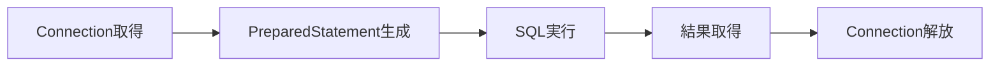
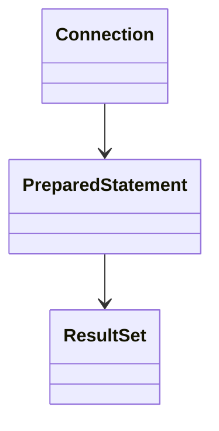
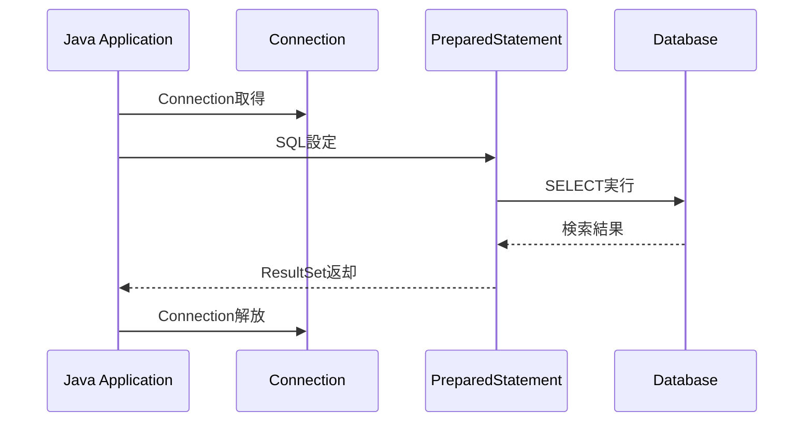
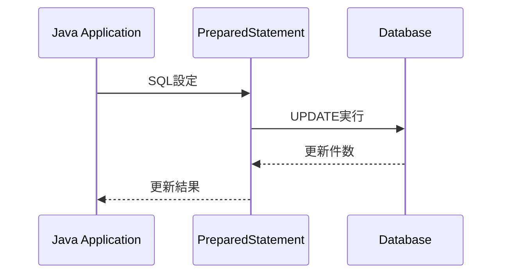
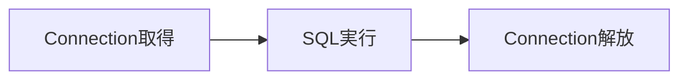
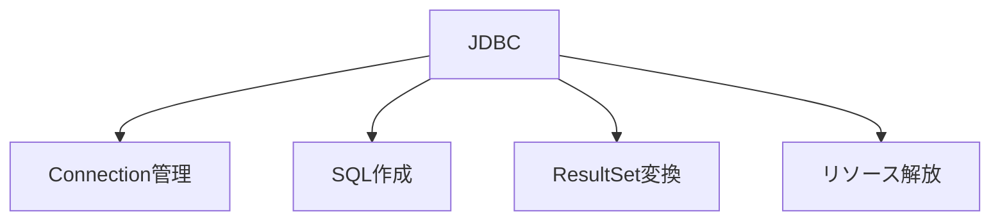
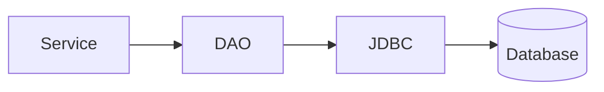

# SQL実行の基本的な流れ

## 1. 概要

前章では、JavaアプリケーションがJDBCを利用してデータベースへアクセスする仕組みについて説明した。

本章では、実際にSQLを実行する際の基本的な処理の流れについて説明する。

JDBCでは、データベースへの接続を取得し、SQLを実行し、その実行結果を受け取るという手順で処理が進む。


## 2. SQL実行の全体像

JavaアプリケーションがSQLを実行する際の処理全体は以下のようになる。




## 3. SQL実行時に利用する主なクラス

JDBCでは複数のインタフェースを組み合わせてSQLを実行する。



| クラス | 役割 |
|----------|----------|
| Connection | データベースとの接続を表す |
| PreparedStatement | SQLを実行する |
| ResultSet | 検索結果を保持する |


## 4. SELECT実行の流れ

検索処理（SELECT）を例に、処理の流れを見てみる。




### サンプルコード

```java
String sql =
    "SELECT user_id, user_name " +
    "FROM users " +
    "WHERE user_id = ?";

try (
    Connection conn =
        dataSource.getConnection();

    PreparedStatement stmt =
        conn.prepareStatement(sql)
) {

    stmt.setLong(1, 1L);

    ResultSet rs = stmt.executeQuery();

    while (rs.next()) {

        Long userId =
            rs.getLong("user_id");

        String userName =
            rs.getString("user_name");
    }
}
```


### コードのポイント

| コード | 説明 |
|----------|----------|
| `getConnection()` | データベース接続を取得する |
| `prepareStatement()` | SQLを準備する |
| `setLong()` | SQLのプレースホルダへ値を設定する |
| `executeQuery()` | SELECT文を実行する |
| `ResultSet` | 検索結果を受け取る |
| `rs.next()` | 次のレコードへ移動する |
| `getString()` | カラム値を取得する |


## 5. UPDATE実行の流れ

更新処理の場合は検索結果を取得しない。




### サンプルコード

```java
String sql =
    "UPDATE users " +
    "SET user_name = ? " +
    "WHERE user_id = ?";

try (
    Connection conn =
        dataSource.getConnection();

    PreparedStatement stmt =
        conn.prepareStatement(sql)
) {

    stmt.setString(1, "Taro");
    stmt.setLong(2, 1L);

    int count =
        stmt.executeUpdate();
}
```


### executeQueryとexecuteUpdateの違い

| メソッド | 用途 |
|----------|----------|
| executeQuery() | SELECT |
| executeUpdate() | INSERT / UPDATE / DELETE |

---

> [!NOTE]
> ### Coffee Break: なぜ「?」を使うのか？
>
> SQL内の `?` はプレースホルダと呼ばれる。
>
> PreparedStatementでは、SQLと入力値を分離して扱うことができるため、SQLインジェクションのリスクを低減できる。
>
> 例えば以下のようなコードは推奨されない。
>
> ```java
> String sql =
>     "SELECT * FROM users " +
>     "WHERE user_id = " + userId;
> ```
>
> 現在のJavaアプリケーションでは、PreparedStatementとプレースホルダを利用した実装が一般的である。


## 6. リソース解放の重要性

Connectionはデータベースとの通信資源である。

利用後に解放しない場合、接続数が不足しアプリケーションが正常に動作しなくなる可能性がある。

そのため、利用後は必ずクローズする必要がある。




## 7. JDBCコードの課題

JDBCを直接利用する場合、多くの定型処理が必要となる。



主な課題は以下の通りである。

- SQLを直接記述する必要がある
- ResultSetからオブジェクトへ変換する必要がある
- Connection管理が必要である
- 同じようなコードが繰り返し発生する


## 8. DAOとの関係

これらのデータベースアクセス処理を集約するために、一般的なJavaアプリケーションではDAOパターンを利用する。



DAOを利用することで、JDBCの詳細をアプリケーションの他のレイヤから隠蔽できる。


## 9. まとめ

JDBCによるSQL実行は、Connection取得、PreparedStatement生成、SQL実行、結果取得、Connection解放という手順で実施される。

これらの処理を理解することで、Javaアプリケーションがどのようにデータベースと連携しているかを理解できる。

次章では、JDBCによるデータアクセス処理を集約するDAO（Data Access Object）について説明する。