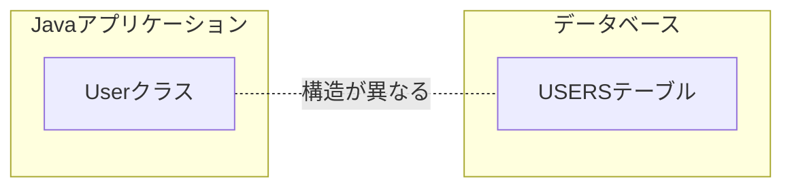
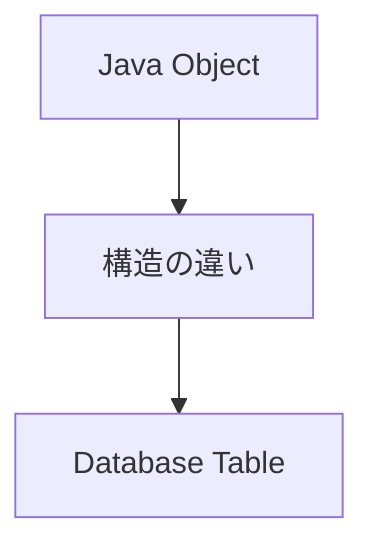
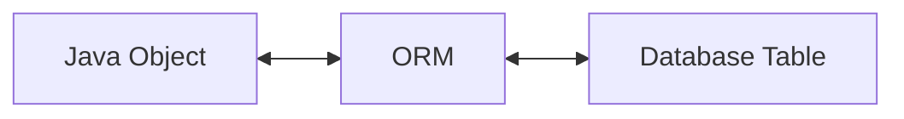
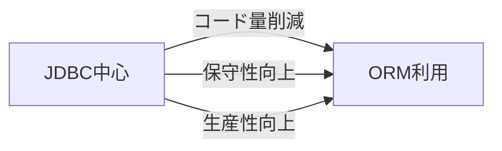
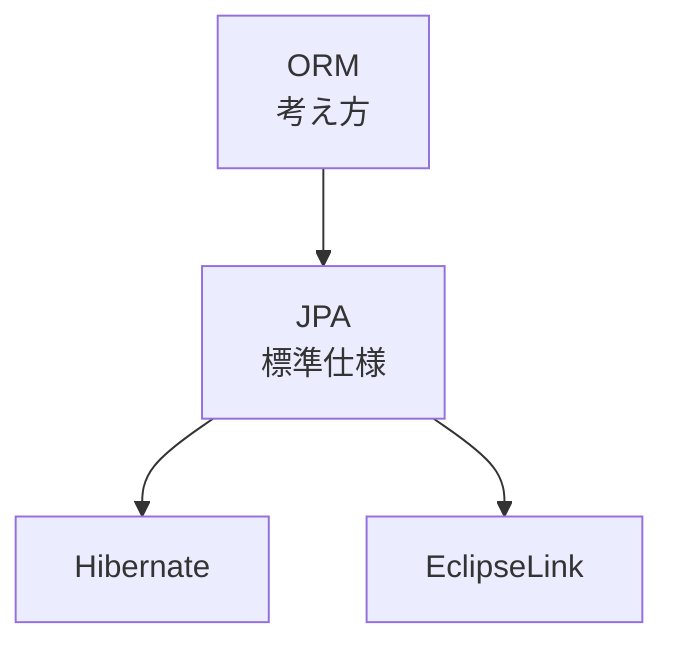

# ORM（Object Relational Mapping）

## 1. 概要

前章までに、JavaアプリケーションがJDBCを利用してデータベースへアクセスする仕組みについて説明した。

JDBCを利用することでデータベースとの連携は可能であるが、実際のアプリケーション開発ではデータベースのテーブルとJavaオブジェクトの間に大きな違いが存在する。

本章では、この違いを解消する仕組みであるORM（Object Relational Mapping）について説明する。

## 2. オブジェクトとテーブルの違い

Javaアプリケーションはオブジェクトを利用して処理を行う。

一方、データベースは表形式のテーブルでデータを管理する。



### Javaオブジェクト

```java
public class User {

    private Long userId;

    private String userName;
}
```

### データベーステーブル

```text
USERS
+---------+------------+
| USER_ID | USER_NAME  |
+---------+------------+
|       1 | Taro       |
+---------+------------+
```

## 3. オブジェクトとテーブルのギャップ

Javaとデータベースではデータの表現方法が異なる。



### 主な違い

| Java | データベース |
|--------|--------|
| クラス | テーブル |
| フィールド | カラム |
| オブジェクト | レコード |
| 継承 | 基本的に存在しない |
| オブジェクト参照 | 外部キー |


例えば利用者情報を取得した場合、

```sql
SELECT
    user_id,
    user_name
FROM users
```

の実行結果を

```java
User user = new User();
```

へ変換しなければならない。

## 4. JDBCだけで実現する場合

JDBCを利用する場合、取得した結果を自分でオブジェクトへ変換する必要がある。

```java
User user = new User();

user.setUserId(
    rs.getLong("user_id"));

user.setUserName(
    rs.getString("user_name"));
```


### JDBC利用時の課題

- マッピングコードが増える
- 同じ処理を何度も記述する
- 保守コストが高くなる
- 開発効率が低下する

## 5. ORMとは

ORM（Object Relational Mapping）は、オブジェクトとテーブルの対応付けを自動化する仕組みである。

開発者はテーブルを直接意識するのではなく、Javaオブジェクトを操作することでデータベースへアクセスできる。



## 6. ORMによるデータ取得

ORMではオブジェクトを取得する感覚でデータを扱うことができる。


#### JDBCの場合

```java
ResultSet rs = stmt.executeQuery();

User user = new User();

user.setUserId(
    rs.getLong("user_id"));

user.setUserName(
    rs.getString("user_name"));
```

#### ORMの場合

```java
User user = ...
```

開発者がResultSetを操作する必要がなくなる。

## 7. ORMのメリット

#### 開発効率向上

テーブルとオブジェクトの変換処理を自動化できる。

#### 保守性向上

マッピング処理の重複を削減できる。

#### 可読性向上

業務ロジックに集中できるコードになる。

#### 生産性向上

SQL以外の定型コードを削減できる。



> [!NOTE]
> ### Coffee Break: ORMはDBを意識しなくてよいわけではない
>
> ORMを利用すると、Javaオブジェクト中心に開発できるようになる。
>
> しかし内部ではデータベースとの通信が行われており、SQLやテーブル設計の知識が不要になるわけではない。
>
> 現場では「Javaの知識」と「データベースの知識」の両方が重要となる。

## 8. JavaにおけるORM

Javaでは複数のORM製品が存在する。

| 製品 | 説明 |
|--------|--------|
| Hibernate | Javaで最も広く利用されているORM実装 |
| EclipseLink | Jakarta EEのリファレンス実装 |
| OpenJPA | Apacheが提供するORM実装 |

これらのORM実装の上位仕様としてJPAが存在する。

## 9. ORMとJPAの関係

ORMは考え方や仕組みを指す言葉である。

一方、JPAはJavaにおけるORMの標準仕様である。



## 10. まとめ

ORMは、Javaオブジェクトとデータベーステーブルの対応付けを自動化する仕組みである。

ORMを利用することで、開発者はテーブル操作よりも業務ロジックの実装に集中できるようになる。

JavaではJPAがORMの標準仕様として定義されており、多くのフレームワークやアプリケーションで利用されている。
