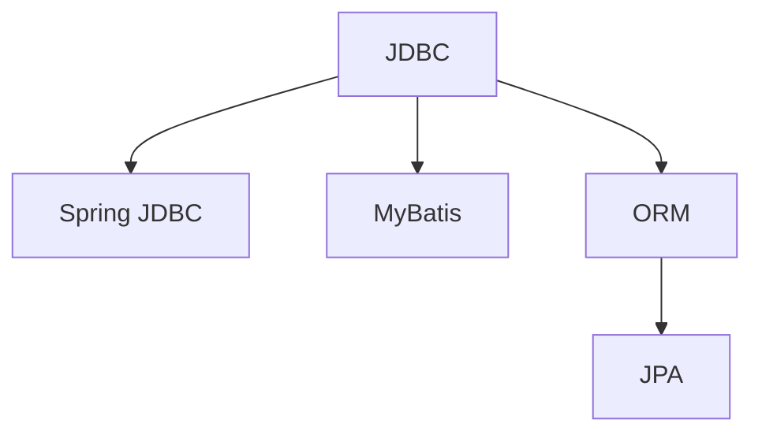
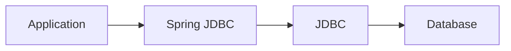
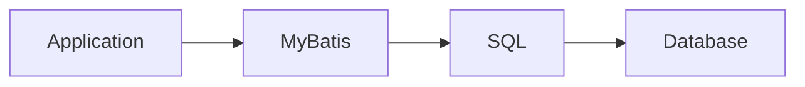
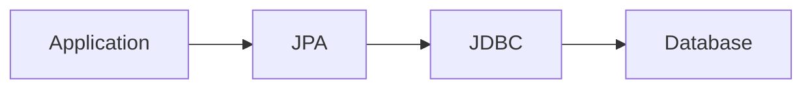
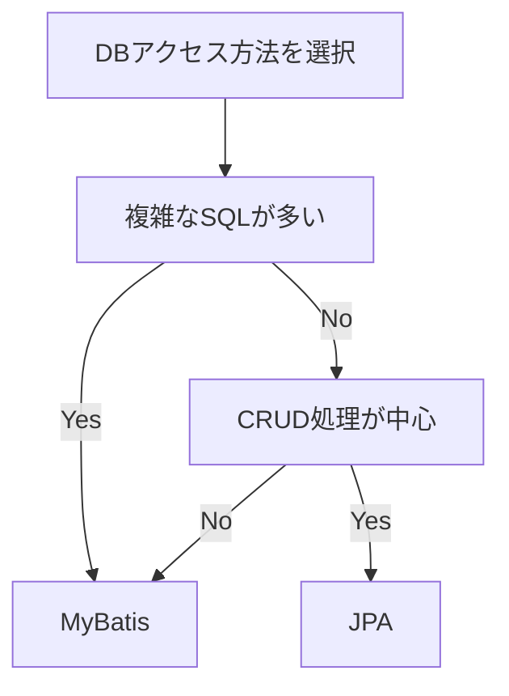

# JPAやSpring JDBC、MyBatis

## 1. 概要

前章では、Javaオブジェクトとデータベーステーブルの対応付けを行うORM（Object Relational Mapping）について説明した。

Javaアプリケーションでは、データベースアクセスを効率的に実装するために様々なフレームワークやライブラリが利用されている。

本章では、代表的なデータアクセス技術であるSpring JDBC、MyBatis、JPAについて説明する。

## 2. データアクセス技術の位置付け

Javaアプリケーションでは、JDBCを直接利用するだけでなく、より開発しやすい仕組みが利用されることが一般的である。



## 3. Spring JDBC

Spring JDBCは、JDBCを利用しやすくするためのライブラリである。

JDBCではConnection管理や例外処理などの定型コードが多くなるが、Spring JDBCを利用することでそれらを簡略化できる。



### 特徴

- JDBCの記述量を削減できる
- SQLを直接記述できる
- JDBCの知識をそのまま活用できる
- 学習コストが比較的低い

### 利用イメージ

#### JDBC

```java
Connection conn = ...
PreparedStatement stmt = ...
ResultSet rs = ...
```

#### Spring JDBC

```java
jdbcTemplate.query(...)
```

## 4. MyBatis

MyBatisは、SQL中心で開発を行うデータアクセスフレームワークである。

SQLは開発者が記述し、取得した結果をJavaオブジェクトへマッピングする機能を提供する。



### 特徴

- SQLを明示的に記述できる
- 複雑なSQLを扱いやすい
- SQLチューニングが容易
- 大規模業務システムで採用実績が多い

### 利用イメージ

```xml
<select id="findUserById">
    SELECT
        user_id,
        user_name
    FROM users
    WHERE user_id = #{userId}
</select>
```

```java
User user =
    userMapper.findUserById(1L);
```

## 5. JPA

JPA（Java Persistence API）は、JavaにおけるORMの標準仕様である。

開発者はSQLではなくJavaオブジェクトを中心に扱い、データベースアクセスを実現する。

JPAの実装としてHibernateやEclipseLinkなどが利用される。



### 特徴

- ORMによる開発が可能
- オブジェクト指向設計との親和性が高い
- 定型的なCRUD処理を削減できる
- SQL記述量を削減できる

### 利用イメージ

#### エンティティ

```java
@Entity
public class User {

    @Id
    private Long userId;

    private String userName;
}
```

#### データ取得

```java
User user =
    entityManager.find(
        User.class,
        1L
    );
```

## 6. 各技術の比較

| 項目 | Spring JDBC | MyBatis | JPA |
|--------|--------|--------|--------|
| SQL記述 | 必須 | 必須 | 基本不要 |
| ORM | × | △ | ○ |
| 学習コスト | 低 | 中 | 高 |
| SQL制御 | 高 | 高 | 低 |
| オブジェクト指向との親和性 | 低 | 中 | 高 |
| 複雑なSQL | ○ | ◎ | △ |
| CRUD処理 | ○ | ○ | ◎ |

## 7. どの技術を選択するか

システム要件に応じて適切な技術を選択することが重要である。




> [!NOTE]
> ### Coffee Break: JPAは製品名ではない
>
> JPAはフレームワークや製品名ではなく、JavaにおけるORMの標準仕様である。
>
> 実際にはHibernateやEclipseLinkなどの製品がJPAを実装している。
>
> そのため、
>
> - JPA = 仕様
> - Hibernate = 実装
>
> と考えると理解しやすい。

## 8. TERASOLUNAにおける利用例

TERASOLUNAでは、プロジェクト要件に応じてMyBatisまたはJPAが利用される。

#### MyBatisが向いているケース

- 複雑なSQLが多い
- SQLチューニングが重要
- DB中心の設計

#### JPAが向いているケース

- CRUD処理が中心
- オブジェクト指向設計を重視する
- SQL記述量を減らしたい

## 9. まとめ

Javaアプリケーションでは、JDBCを直接利用する以外にSpring JDBC、MyBatis、JPAといった様々なデータアクセス技術を利用できる。

Spring JDBCはJDBCを簡略化する仕組み、MyBatisはSQL中心の開発を支援するフレームワーク、JPAはORMを実現するための標準仕様である。

それぞれ特徴や得意分野が異なるため、システム要件に応じて適切な技術を選択することが重要である。