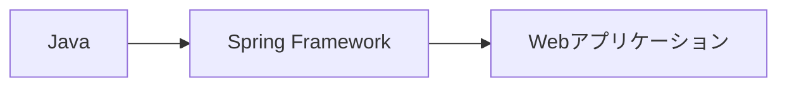
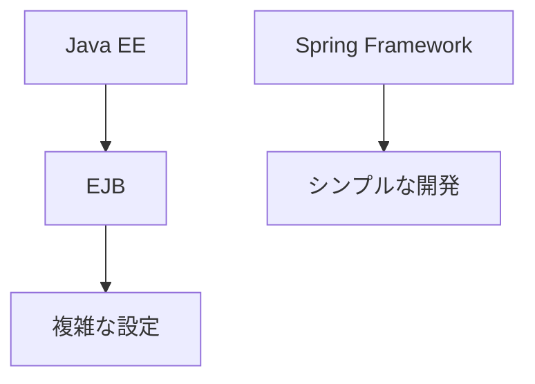
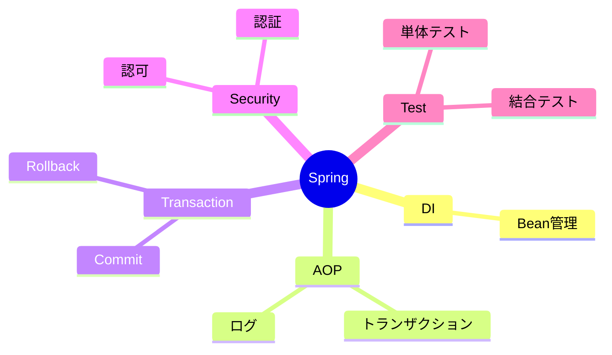
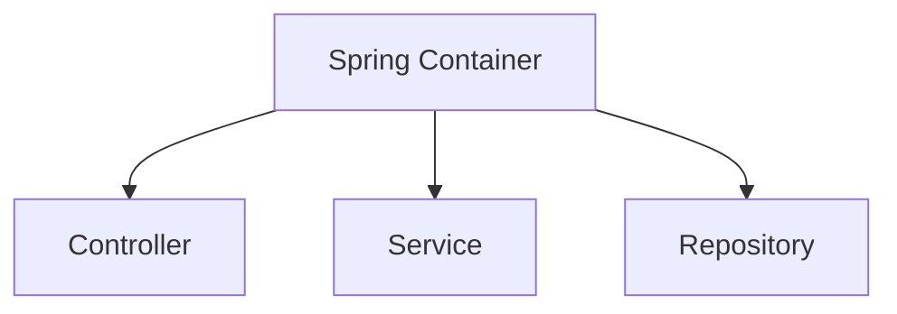
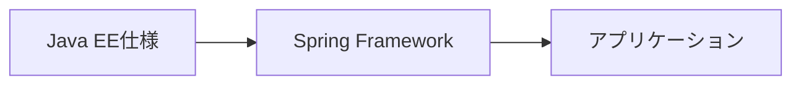
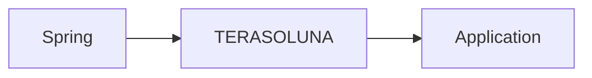

# Spring Framework概要

## 1. 概要

これまでの章では、Java Webアプリケーションの構造やデータベースアクセスについて説明してきた。

Java EEは大規模システム向けの機能を多く提供している一方で、設定や実装が複雑になりやすいという課題があった。

Spring Frameworkは、そのような課題を解決するために開発されたJava向けアプリケーションフレームワークである。

本章では、Spring Frameworkの概要と主要機能について説明する。

## 2. Springとは

Spring Frameworkは、エンタープライズアプリケーション開発を容易にするためのオープンソースフレームワークである。

Java EEで実現していた機能をよりシンプルに実装できるよう設計されており、現在ではJava開発における代表的なフレームワークの一つとなっている。



## 3. Springが登場した背景

Springが登場する以前のJava EE開発では、EJB（Enterprise JavaBeans）を中心とした開発が一般的だった。

しかし、EJBを利用するためには多くの設定や複雑なコードが必要であった。



### Java EE開発の課題

- 設定ファイルが多い
- 開発効率が低い
- テストが難しい
- オブジェクト生成を開発者が管理する必要がある

### Springが目指したもの

- POJO（Plain Old Java Object）中心の開発
- 設定の簡略化
- テスト容易性の向上
- 依存関係管理の自動化

## 4. Springの主な機能

Springは多くの機能を提供している。



### 主な機能一覧

| 機能 | 説明 |
|--------|--------|
| DI（Dependency Injection） | オブジェクトの依存関係を管理する |
| AOP（Aspect Oriented Programming） | 共通処理を横断的に適用する |
| Transaction Management | トランザクションを管理する |
| Spring Security | 認証・認可機能を提供する |
| Spring Test | テスト支援機能を提供する |

## 5. Springが管理するアプリケーション

Springでは、アプリケーションを構成するオブジェクトをコンテナで管理する。



### 従来の実装

開発者自身がオブジェクトを生成する。

```java
UserService service =
    new UserService();
```

### Spring利用時

Springがオブジェクトを生成・管理する。

```java
@Inject
private UserService service;
```

> [!NOTE]
> ### Coffee Break: SpringはBean工場
>
> Spring Frameworkを一言で表現すると、「Beanを管理する工場」と考えると分かりやすい。
>
> 開発者は業務ロジックを実装したクラスを作成するだけでよく、オブジェクトの生成や管理はSpringが担当する。
>
> この仕組みによってコード同士の結合度を下げ、保守しやすいアプリケーションを実現できる。

## 6. SpringとJava EEの関係

SpringとJava EEは対立する技術ではない。

Spring FrameworkはJava EEの仕様を活用しながら、より開発しやすい環境を提供している。



### 利用例

| Java EE | Spring |
|--------|--------|
| CDI | Spring DI |
| JPA | Spring Data JPA |
| Servlet | Spring MVC |
| JTA | Spring Transaction |

## 7. TERASOLUNAとの関係

TERASOLUNA FrameworkはSpring Frameworkをベースとして構築されている。

そのため、TERASOLUNAを理解するためにはSpringの基本概念を理解することが重要である。



TERASOLUNAでは特に以下のSpring機能を利用する。

- DI
- AOP
- トランザクション管理
- Spring MVC
- Spring Security

## 8. まとめ

Spring Frameworkは、Javaアプリケーション開発をシンプルにするためのフレームワークである。

SpringはDI、AOP、トランザクション管理、認証認可、テスト支援など、多くの機能を提供している。

特にSpringの中心的な機能であるDI（Dependency Injection）は、Springを理解するうえで最も重要な概念である。

次章では、Springの中核機能であるDependency Injection（DI）について詳しく説明する。