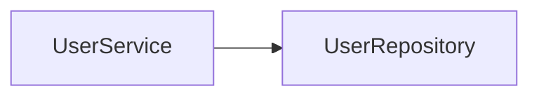
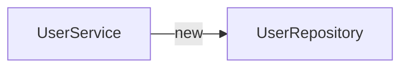
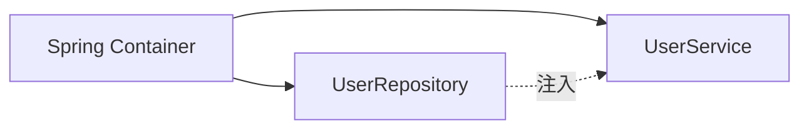
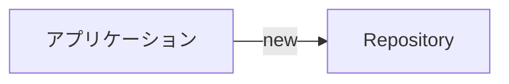
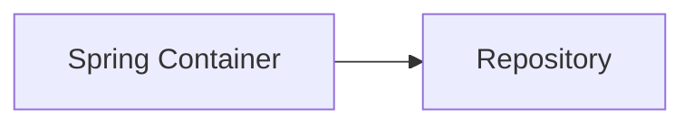
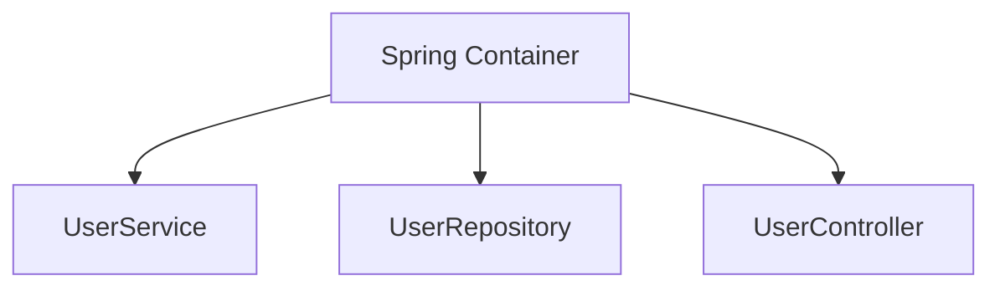
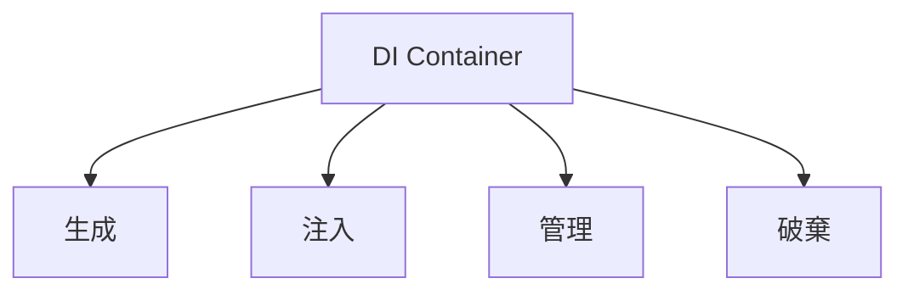
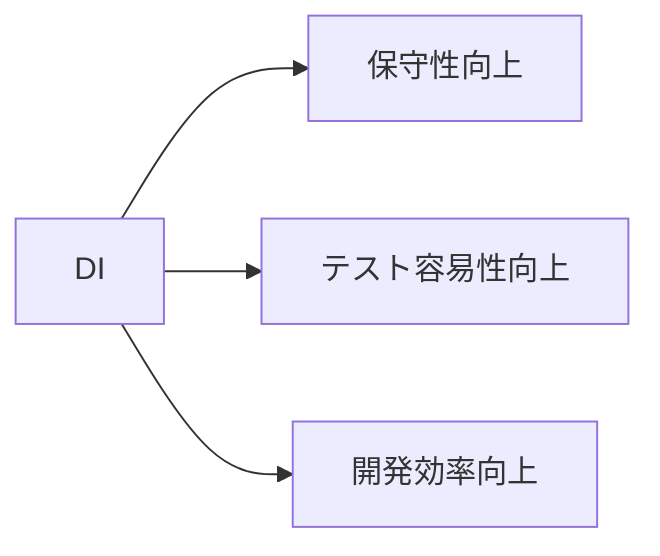

# Dependency Injection（DI）

## 1. 概要

前章では、Spring FrameworkがBeanを管理するためのフレームワークであることを説明した。

Springの最も重要な機能の一つがDI（Dependency Injection）である。

DIを利用することで、オブジェクト同士の依存関係をSpringが管理し、開発者は業務ロジックの実装に集中できるようになる。

本章では、DIの考え方とSpringにおける実現方法について説明する。

## 2. オブジェクト間の依存関係

アプリケーションには複数のクラスが存在し、それらは互いに連携しながら動作する。

例えば、利用者情報を取得するアプリケーションでは、ServiceがRepositoryを利用する。



このように、あるオブジェクトが別のオブジェクトを利用する関係を「依存関係」と呼ぶ。

## 3. DIがない場合

従来のJavaでは、利用するオブジェクトを自分で生成していた。

```java
public class UserService {

    private UserRepository repository =
            new UserRepository();

}
```



### 課題

#### 強い結合が発生する

UserServiceはUserRepositoryの実装に直接依存している。

#### テストが難しい

Mockオブジェクトへ差し替えにくい。

#### 変更に弱い

UserRepositoryの変更がUserServiceへ影響する。

## 4. DIとは

DI（Dependency Injection）は、オブジェクトが必要とする依存オブジェクトを外部から注入する仕組みである。

開発者が `new` を使用してオブジェクトを生成する代わりに、Springがオブジェクトを生成し必要な箇所へ注入する。



### DI適用後

```java
public class UserService {

    @Inject
    private UserRepository repository;

}
```

UserServiceはUserRepositoryを生成しない。

Springが生成したオブジェクトを利用する。

## 5. IoC（Inversion of Control）

DIを理解するために、IoCという考え方を知る必要がある。

IoC（Inversion of Control）は「制御の反転」を意味する。

従来は開発者がオブジェクト生成を制御していた。



Spring利用時は、Springがオブジェクト生成を管理する。



### 制御の違い

| 項目 | 従来 | Spring |
|--------|--------|--------|
| オブジェクト生成 | 開発者 | Spring |
| ライフサイクル管理 | 開発者 | Spring |
| 依存関係管理 | 開発者 | Spring |

## 6. Beanとは

Springが管理するオブジェクトをBeanと呼ぶ。




例えば以下のクラスが存在するとする。

```java
@Service
public class UserService {

}
```

このクラスのオブジェクトはSpringによって生成・管理される。

そのため、UserServiceはBeanとして扱われる。

## 7. DIコンテナとは

Beanの生成や管理を行う仕組みをDIコンテナと呼ぶ。

SpringではDIコンテナが以下の処理を担当する。

- Bean生成
- Bean破棄
- 依存関係解決
- Bean管理




> [!NOTE]
> ### Coffee Break: Beanとコンテナの関係
>
> Beanは「管理対象のオブジェクト」、コンテナは「Beanを管理する仕組み」と考えると理解しやすい。
>
> 例えば工場に例えると、
>
> - Bean = 製品
> - コンテナ = 工場
>
> に相当する。
>
> 開発者は製品（Bean）を作る設計図（クラス）を用意し、Springが工場（コンテナ）として生成・管理を行う。

## 8. @Injectと@Autowired

Springではアノテーションを利用してDIを実現する。

### @Inject

```java
@Inject
private UserRepository repository;
```

Java標準仕様（Jakarta CDI）のDIアノテーションである。

### @Autowired

```java
@Autowired
private UserRepository repository;
```

Spring独自のDIアノテーションである。

### 使い分け

現在は `@Inject` を利用するプロジェクトも多く、TERASOLUNAでも利用されることがある。

どちらも「Beanを注入する」という目的は同じである。

## 9. DIのメリット

### 結合度の低減

クラス同士の依存関係を弱くできる。

### テスト容易性向上

Mockへ差し替えやすい。

### 保守性向上

実装変更の影響範囲を限定できる。

### 生産性向上

オブジェクト生成コードを削減できる。



## 10. 実際のTERASOLUNAでの利用例

```java
@Controller
public class UserController {

    @Inject
    private UserService userService;

}
```

```java
@Service
public class UserService {

    @Inject
    private UserRepository userRepository;

}
```

```java
@Repository
public class UserRepository {

}
```


DIにより、各クラスは依存オブジェクトの生成を意識することなく利用できる。

## 11. まとめ

DI（Dependency Injection）は、オブジェクトが必要とする依存オブジェクトを外部から注入する仕組みである。

SpringではDIコンテナがBeanの生成や管理を担当し、アプリケーションの結合度を下げることで保守性やテスト容易性を向上させている。

DIはSpring Frameworkを理解するうえで最も重要な概念であり、TERASOLUNAでも広く利用されている。

次章では、SpringがBeanとして管理するコンポーネントを定義するためのステレオタイプアノテーションについて説明する。