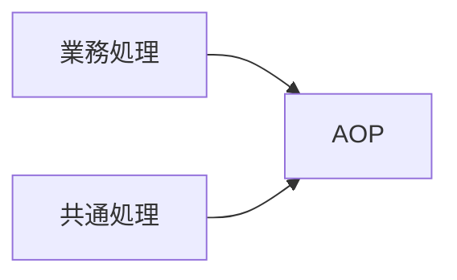
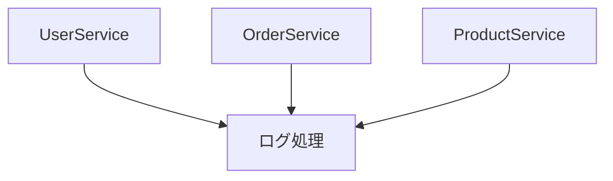
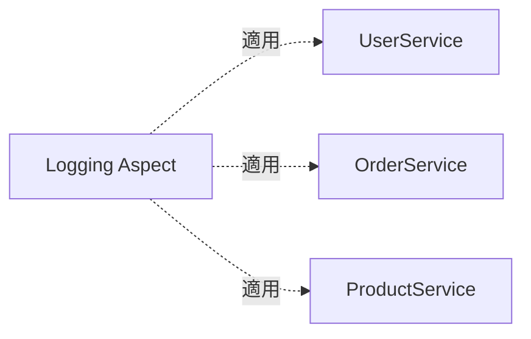
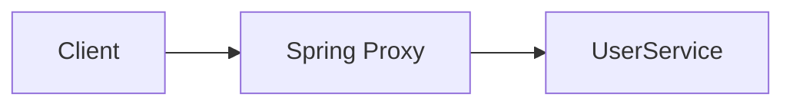
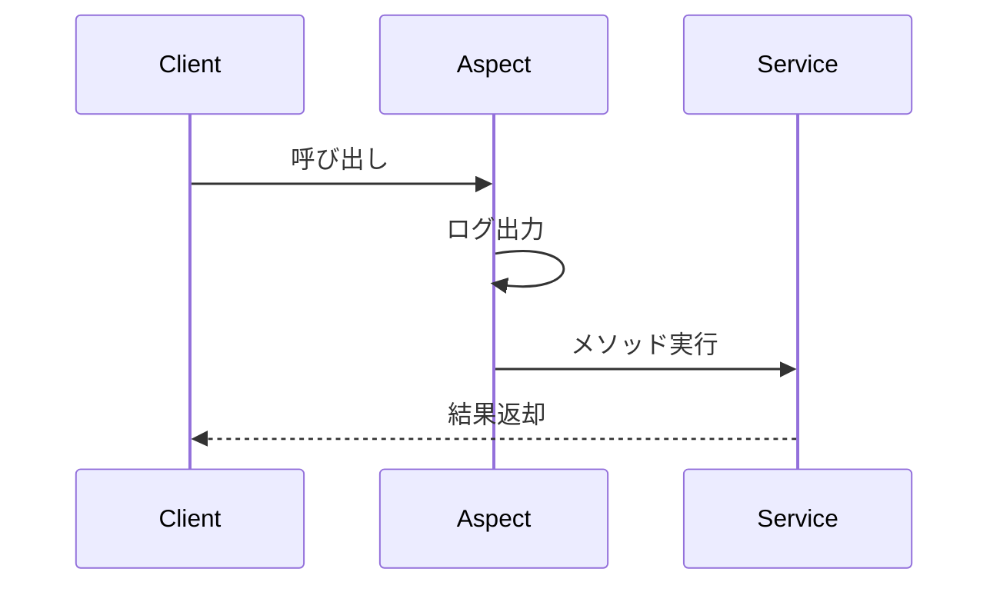
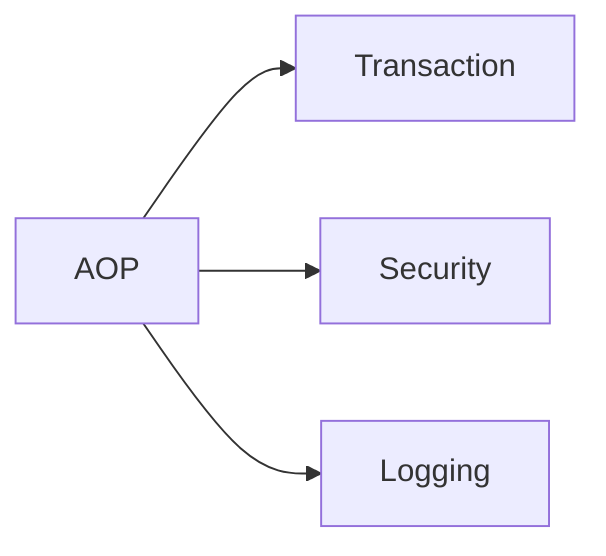
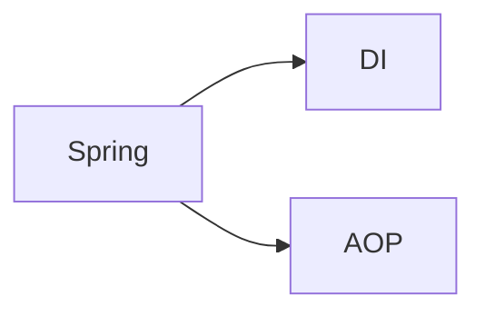

# AOP（Aspect Oriented Programming）

## 1. 概要

前章では、DI（Dependency Injection）によってオブジェクト同士の依存関係をSpringが管理する仕組みについて説明した。

Spring FrameworkはDIに加えて、AOP（Aspect Oriented Programming）と呼ばれる機能を提供している。

AOPを利用することで、アプリケーション全体で共通となる処理を一箇所にまとめて実装できる。

本章では、AOPの考え方とSpringにおける活用方法について説明する。

## 2. AOPとは

AOP（Aspect Oriented Programming）は、日本語では「アスペクト指向プログラミング」と呼ばれる。

ログ出力やトランザクション管理など、多くのクラスで共通して行われる処理を独立して実装するための考え方である。



## 3. AOPがない場合

例えば複数のServiceクラスでログを出力したい場合を考える。

```java
public class UserService {

    public User findUser() {

        System.out.println("START");

        // 業務処理

        System.out.println("END");

        return user;
    }
}
```

```java
public class OrderService {

    public Order findOrder() {

        System.out.println("START");

        // 業務処理

        System.out.println("END");

        return order;
    }
}
```

### 課題

- 同じコードが繰り返される
- 修正箇所が増える
- 業務ロジックが見づらくなる



## 4. 横断的関心事

ログ出力やトランザクション管理のように、多くのクラスで共通して利用される処理を横断的関心事（Cross-Cutting Concern）と呼ぶ。

### 代表的な横断的関心事

| 処理 | 説明 |
|--------|--------|
| ログ出力 | メソッド開始・終了ログ |
| トランザクション | Commit / Rollback |
| 認証 | ログインチェック |
| 認可 | 権限チェック |
| 監査ログ | 操作履歴記録 |
| 例外処理 | エラーハンドリング |

## 5. AOPによる解決

AOPでは共通処理をAspectとして切り出す。



### メリット

- 共通処理を一箇所へ集約できる
- 業務ロジックがシンプルになる
- 保守性が向上する

## 6. Spring AOPの仕組み

SpringはProxyという仕組みを利用してAOPを実現する。



### 処理イメージ

```text
1. クライアントがServiceを呼び出す

2. Spring Proxyが処理を横取りする

3. ログ出力などの共通処理を実行する

4. Serviceを実行する

5. 共通処理を実行する
```

## 7. Aspectとは

共通処理をまとめたクラスをAspectと呼ぶ。

```java
@Aspect
@Component
public class LoggingAspect {

}
```

### 主なアノテーション

| アノテーション | 説明 |
|--------|--------|
| @Aspect | Aspectクラスとして定義する |
| @Before | メソッド実行前に処理する |
| @After | メソッド実行後に処理する |
| @Around | 前後両方で処理する |
| @AfterThrowing | 例外発生時に処理する |

## 8. Spring AOPのサンプル

### Aspect

```java
@Aspect
@Component
public class LoggingAspect {

    @Before(
        "execution(* com.example.service.*.*(..))"
    )
    public void before() {

        System.out.println(
            "サービス実行開始"
        );
    }
}
```

### Service

```java
@Service
public class UserService {

    public User findUser() {

        return new User();
    }
}
```

### 実行イメージ



## 9. AOPが利用される代表例

実際には開発者が直接Aspectを作成するよりも、Springが提供する機能で利用されることが多い。

### トランザクション管理

```java
@Transactional
public void registerUser() {

}
```

### Spring Security

```java
@PreAuthorize("hasRole('ADMIN')")
public void deleteUser() {

}
```


これらも内部ではAOPが利用されている。




> [!NOTE]
> ### Coffee Break: Springを学ぶとAOPを意識しなくなる
>
> Spring初心者はAOPを難しく感じることが多い。
>
> しかし実際の開発では、AOPを直接実装するケースはそれほど多くない。
>
> むしろ、
>
> - @Transactional
> - Spring Security
> - ログ出力
>
> などの機能を利用しているときに、裏側でAOPが動いていると理解しておけば十分である。
>
> SpringのAOPは、「共通処理を自動的に差し込む仕組み」と考えると分かりやすい。

## 10. DIとAOPの関係

Springの中心機能はDIとAOPである。



| 機能 | 役割 |
|--------|--------|
| DI | オブジェクトの依存関係を管理する |
| AOP | 共通処理を管理する |

## 11. まとめ

AOP（Aspect Oriented Programming）は、ログ出力やトランザクション管理などの横断的関心事を分離して実装するための仕組みである。

SpringではProxyを利用してAOPを実現しており、開発者は共通処理をAspectとして定義できる。

また、Spring TransactionやSpring Securityなどの主要機能も内部的にはAOPを利用して実装されている。

次章では、Springが提供するトランザクション管理機能について説明する。