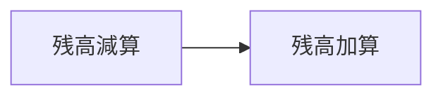
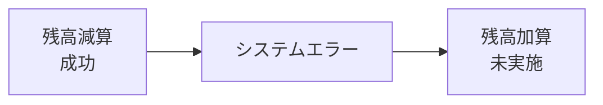
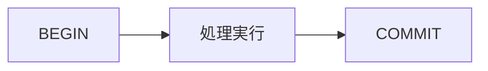
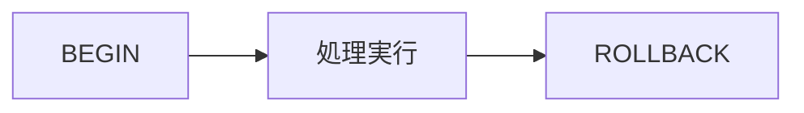
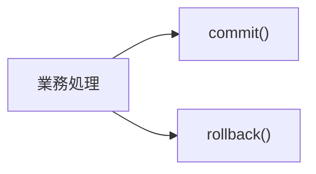
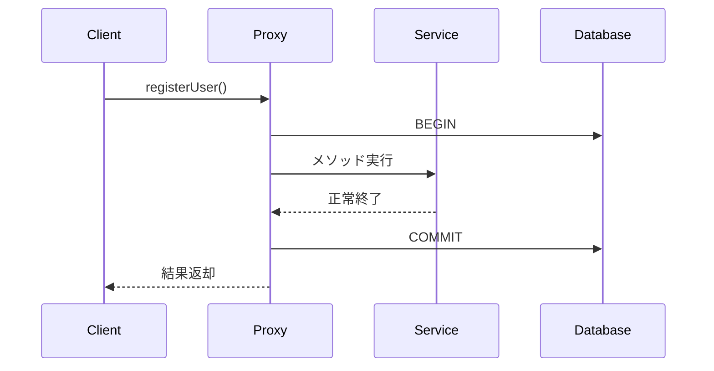
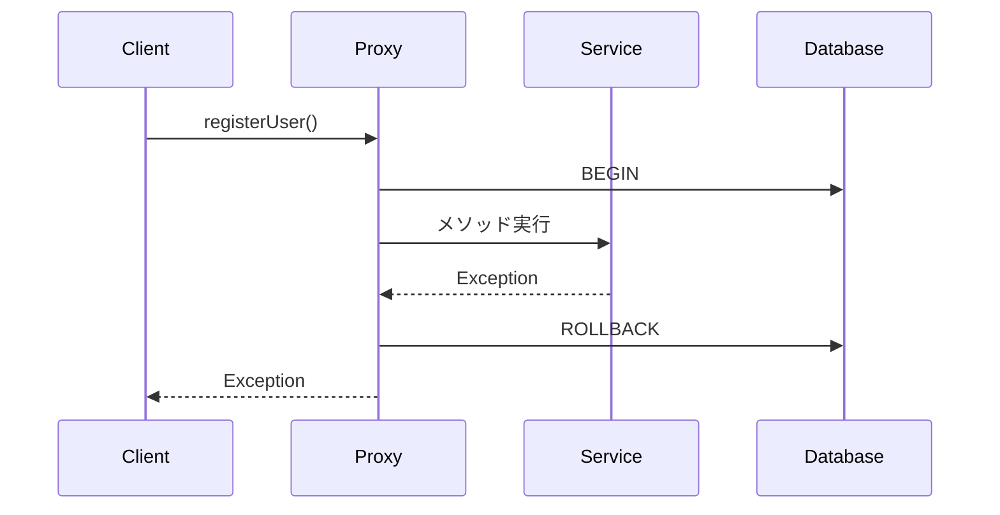
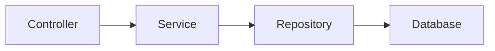
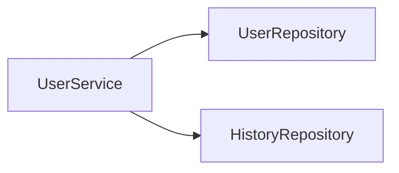

# トランザクション管理

## 1. 概要

前章では、Spring AOPによって共通処理を業務ロジックから分離できることを説明した。

トランザクション管理は、Spring AOPの代表的な利用例の一つである。

本章では、トランザクションの基本概念およびSpringによるトランザクション管理について説明する。

## 2. トランザクションとは

トランザクションとは、一連の処理をひとまとまりとして実行する単位である。

例えば銀行振込では、

1. 振込元口座の残高を減らす
2. 振込先口座の残高を増やす

という2つの処理が必要となる。



この2つの処理は必ず両方成功する必要がある。

### 問題となるケース



振込元だけ残高が減少し、振込先へ反映されない状態となる。

## 3. トランザクションが解決すること

トランザクションを利用すると、

- 全て成功
- 全て失敗

のどちらかになる。



エラー発生時



### 用語

| 用語 | 説明 |
|--------|--------|
| BEGIN | トランザクション開始 |
| COMMIT | 変更内容を確定する |
| ROLLBACK | 処理開始前の状態へ戻す |

## 4. JDBCでのトランザクション管理

Springを利用しない場合、開発者自身がトランザクションを管理する必要がある。

```java
Connection conn = dataSource.getConnection();

try {

    conn.setAutoCommit(false);

    // 更新処理

    conn.commit();

} catch (Exception e) {

    conn.rollback();

}
```

### 課題

- 毎回同じコードを書く必要がある
- commit忘れが発生する
- rollback忘れが発生する
- コードが複雑になる



## 5. Springによるトランザクション管理

Springでは `@Transactional` を利用することでトランザクション管理を自動化できる。

```java
@Service
public class UserService {

    @Transactional
    public void registerUser() {

        // 更新処理

    }
}
```

### 開発者が意識すること

```java
@Transactional
public void registerUser() {

}
```

のみ。

### Springが実施すること

```text
BEGIN

registerUser()

COMMIT
```

または

```text
BEGIN

registerUser()

エラー発生

ROLLBACK
```

## 6. Spring内部での処理

SpringはAOPを利用してトランザクション処理を自動的に追加する。




エラー発生時



## 7. @Transactional

Springで最も利用頻度の高いアノテーションの一つである。

```java
@Transactional
public void updateUser() {

}
```

### 適用対象

- Serviceクラス
- 更新処理
- 複数テーブル更新処理

### 例

```java
@Transactional
public void createOrder() {

    orderRepository.save(order);

    stockRepository.updateStock();

}
```

2つの更新処理を1つのトランザクションとして実行できる。

## 8. トランザクション境界

一般的にはService層へ設定する。




```java
@Service
public class UserService {

    @Transactional
    public void updateUser() {

    }
}
```

### なぜService層なのか

Service層では複数のRepositoryを組み合わせて業務処理を実行するためである。



これら全体を1つのトランザクションとして管理できる。

## 9. トランザクション管理のメリット

### データ整合性向上

異常終了時の不整合を防止できる。

### コード量削減

commitやrollbackを記述しなくてよい。

### 保守性向上

業務ロジックとトランザクション管理を分離できる。

### AOPとの親和性

共通処理として一元管理できる。


> [!NOTE]
> ### Coffee Break: 実務でAOPを意識する瞬間
>
> 多くの開発者は直接Aspectを作成することは少ない。
>
> しかし、
>
> ```java
> @Transactional
> ```
>
> を利用した瞬間にAOPを利用している。
>
> SpringはProxyを生成し、自動的にBEGIN、COMMIT、ROLLBACKを実行している。
>
> そのため、トランザクション管理はAOPの最も代表的な活用例と言える。

## 10. TERASOLUNAとの関係

TERASOLUNA FrameworkではSpringのトランザクション管理機能を利用する。

一般的にはService層へ `@Transactional` を付与してトランザクション境界を定義する。

```java
@Service
@Transactional
public class UserService {

}
```

この構成により、業務ロジックとトランザクション管理を分離しつつ、データの整合性を確保できる。

## 11. まとめ

トランザクションは、一連の処理をひとまとまりとして実行する仕組みである。

Springでは `@Transactional` を利用することで、JDBCの複雑なトランザクション管理を意識することなく実装できる。

また、SpringはAOPを利用してBEGIN、COMMIT、ROLLBACKを自動的に実行しており、開発者は業務ロジックの実装に集中できる。