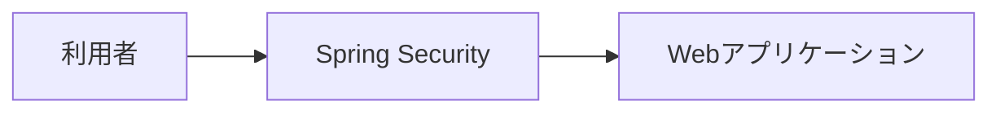
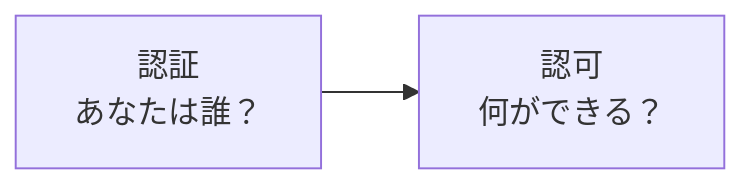
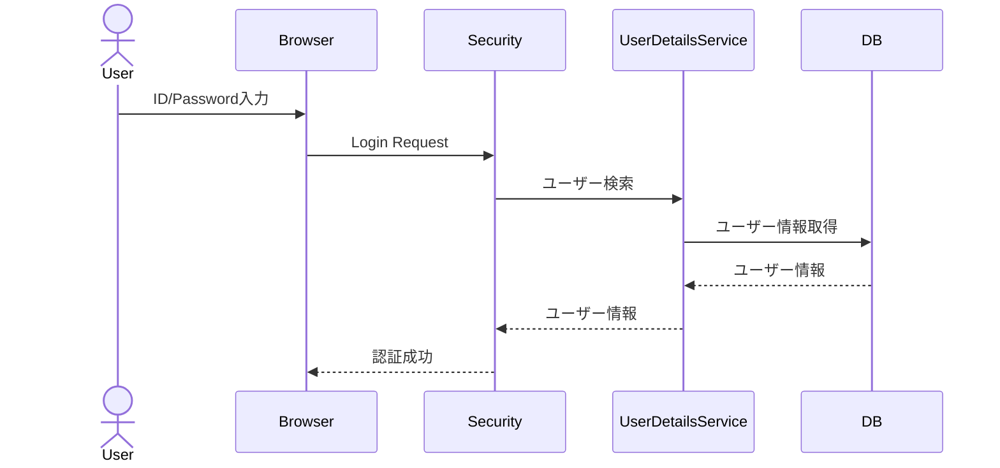
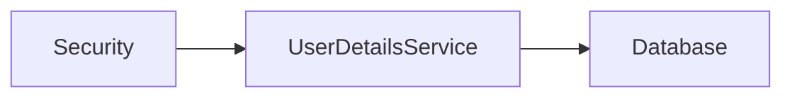
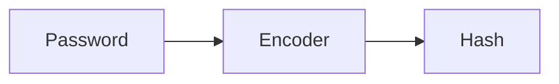
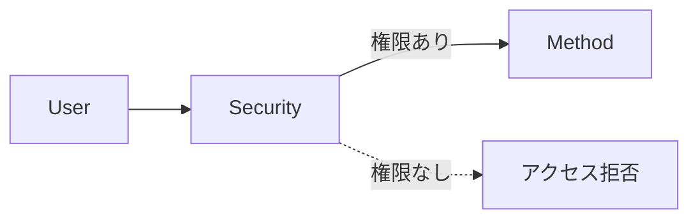
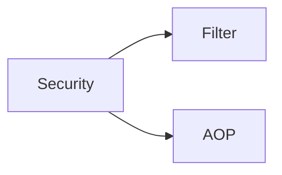
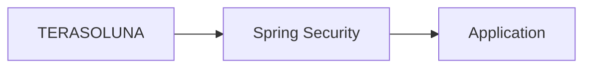

# Spring Security

## 1. 概要

これまでの章では、DIやAOPなどSpring Frameworkの主要機能について説明した。

業務システムでは、誰でも自由にアプリケーションへアクセスできるわけではない。

利用者の本人確認や権限確認を行い、不正なアクセスを防止する仕組みが必要となる。

Spring Securityは、Spring Frameworkが提供するセキュリティフレームワークであり、認証や認可を始めとする様々なセキュリティ機能を提供している。

## 2. Spring Securityとは

Spring Securityは、Springアプリケーション向けの認証・認可フレームワークである。

ログイン処理だけでなく、アクセス制御やセッション管理なども提供している。



## 3. 認証と認可

Spring Securityを理解するために、まず認証と認可の違いを理解する必要がある。

### 認証（Authentication）

認証は、利用者が誰であるかを確認する処理である。

```text
ID: user01
Password: password
```

が正しいか確認する。

### 認可（Authorization）

認証後、その利用者が何を実行できるかを判定する処理である。

例えば、

| ユーザー | 権限 |
|-----------|-----------|
| 一般利用者 | 参照のみ |
| 管理者 | 更新、削除可能 |

のような制御を行う。

### イメージ



## 4. Spring Securityの役割

Spring Securityは主に以下の機能を提供する。

| 機能 | 説明 |
|--------|--------|
| 認証 | ログイン機能 |
| 認可 | 権限チェック |
| パスワード管理 | パスワードハッシュ化 |
| セッション管理 | ログイン状態保持 |
| CSRF対策 | 不正リクエスト防止 |
| URL制御 | アクセス権限制御 |

## 5. リクエスト処理の流れ

Spring SecurityはFilterチェーンを利用してリクエストを制御する。


### 処理概要

1. ブラウザからリクエスト送信
2. Spring Security Filterが受信
3. 認証状態を確認
4. 権限確認を実施
5. Controllerへ処理を委譲

## 6. ログイン処理の流れ

ログイン時は以下のような処理が行われる。



## 7. UserDetailsService

Spring Securityでは、利用者情報の取得にUserDetailsServiceを利用する。

```java
@Service
public class UserDetailsServiceImpl
        implements UserDetailsService {

}
```

### 役割

- ユーザー情報取得
- パスワード取得
- 権限情報取得




## 8. PasswordEncoder

Spring Securityではパスワードを平文で保存しない。

PasswordEncoderを利用してハッシュ化を行う。

```java
PasswordEncoder encoder =
        new BCryptPasswordEncoder();

String encoded =
        encoder.encode("password");
```

### 利用イメージ



## 9. 認可制御

メソッドレベルでもアクセス制御を実装できる。

```java
@PreAuthorize("hasRole('ADMIN')")
public void deleteUser() {

}
```

### 処理イメージ



## 10. Spring SecurityとAOP

Spring Securityは内部でAOPやFilterを利用してアクセス制御を実現している。



### 代表例

```java
@PreAuthorize(...)
```

実行前に権限チェックを行う。


```java
@PostAuthorize(...)
```

実行後に権限チェックを行う。


つまり、Spring SecurityもAOPの考え方を利用した仕組みの一つである。


> [!NOTE]
> ### Coffee Break: 認証と認可は混同しやすい
>
> 認証は「あなたは誰ですか？」を確認する処理である。
>
> 認可は「あなたは何ができますか？」を確認する処理である。
>
> 例えば、管理画面にログインできたとしても、削除機能を利用できるとは限らない。
>
> この違いを理解することがSpring Security学習の第一歩である。

## 11. TERASOLUNAとの関係

TERASOLUNA Frameworkでは、Spring Securityを利用して認証および認可を実装する。

代表的な利用例は以下の通りである。

- ログイン機能
- ログアウト機能
- URLアクセス制御
- ロール管理
- CSRF対策
- セッション管理



## 12. まとめ

Spring Securityは、Springアプリケーション向けの認証・認可フレームワークである。

認証、認可、パスワード管理、セッション管理、CSRF対策など、多くのセキュリティ機能を提供している。

また、内部ではFilterやAOPを利用しており、業務ロジックへセキュリティ処理を組み込むことなく安全なアプリケーションを構築できる。
