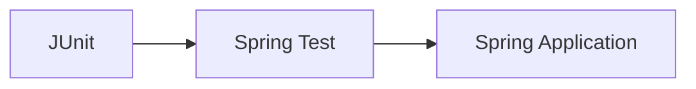
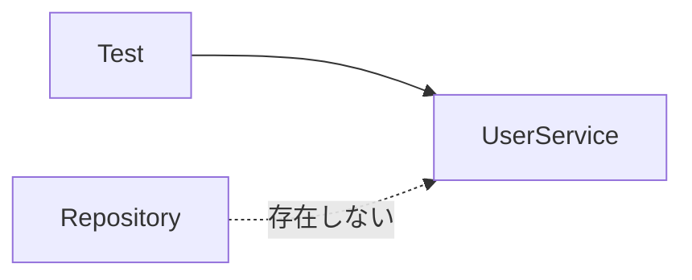
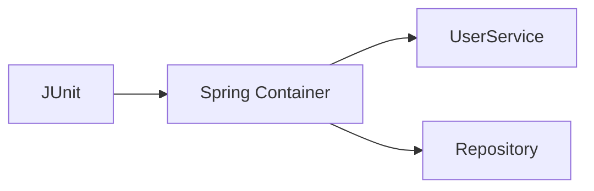
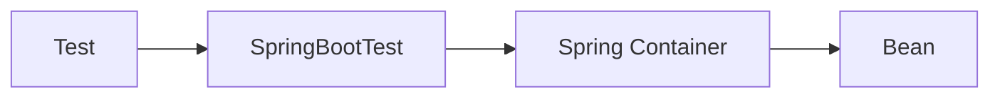
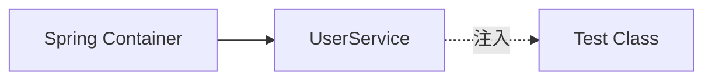
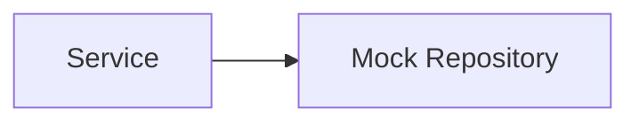
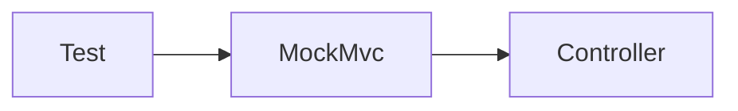
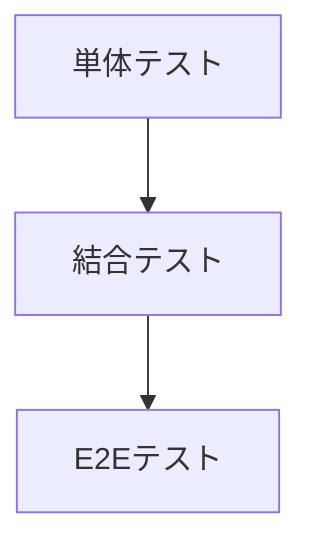
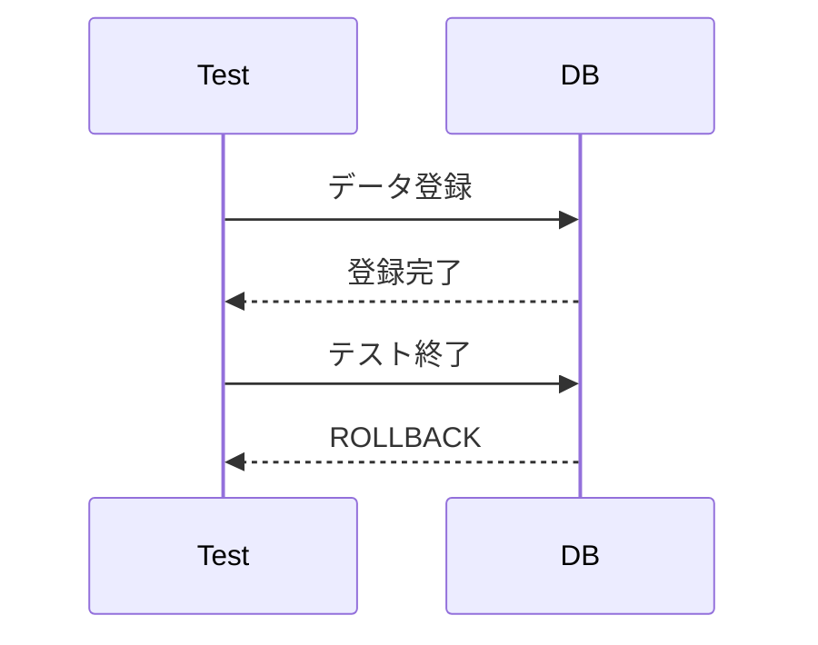
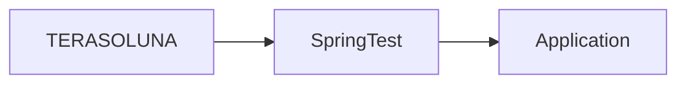

# Spring Test

## 1. 概要

これまでの章では、DIやAOP、Spring SecurityなどSpring Frameworkの主要機能について説明した。

アプリケーション開発では、実装した機能が正しく動作することを確認するためにテストが必要となる。

Spring FrameworkはSpring Testと呼ばれるテスト支援機能を提供しており、DIやトランザクション管理などSpringの仕組みを利用したままテストを実行できる。

本章では、Spring Testの概要と主要機能について説明する。

## 2. Spring Testとは

Spring Testは、Springアプリケーションのテストを支援するフレームワークである。

JUnitと組み合わせて利用することで、Springコンテナを利用したテストを実行できる。



## 3. Spring Testが必要な理由

通常のJUnitでは、Springが管理するBeanを利用できない。

### 通常のJUnit

```java
class UserServiceTest {

    UserService service =
            new UserService();

}
```


しかし、実際のUserServiceはDIによって依存オブジェクトを受け取っている。

```java
@Service
public class UserService {

    @Inject
    private UserRepository repository;

}
```


DIを利用しているクラスを単純に生成すると、依存オブジェクトが存在しないため正しく動作しない。



## 4. Spring Testによる解決

Spring Testでは、テスト実行時にSpringコンテナを起動できる。




これにより、本番環境と同じDI環境でテストを実行できる。

## 5. @SpringBootTest

Spring Testで最もよく利用されるアノテーションである。

```java
@SpringBootTest
class UserServiceTest {

}
```

### 役割

- Springコンテナ起動
- Bean生成
- DI実行
- テスト環境構築

### イメージ



## 6. DIを利用したテスト

テストクラスでもDIを利用できる。

```java
@SpringBootTest
class UserServiceTest {

    @Inject
    private UserService service;

}
```




## 7. Mockオブジェクト

実際のDBや外部システムを利用したくない場合がある。

そのような場合はMockを利用する。



### @MockBean

```java
@SpringBootTest
class UserServiceTest {

    @MockBean
    private UserRepository repository;

}
```

### 利点

- DBアクセス不要
- テスト高速化
- テスト独立性向上

## 8. MockMvc

Spring MVCのControllerをテストするための機能である。

実際にWebブラウザを起動せずにHTTPリクエストを検証できる。



### サンプル

```java
@Autowired
private MockMvc mockMvc;

@Test
void testGetUser() throws Exception {

    mockMvc.perform(get("/users/1"))
           .andExpect(status().isOk());
}
```

### メリット

- ブラウザ不要
- Controller単体で検証可能
- 高速実行

## 9. テストの種類

Spring Testでは様々なレベルのテストを実施できる。




| テスト | 内容 |
|----------|----------|
| 単体テスト | クラス単位で検証 |
| 結合テスト | 複数コンポーネント連携を検証 |
| E2Eテスト | システム全体を検証 |

## 10. トランザクションを利用したテスト

テスト実行後にデータを元に戻したい場合がある。

Spring Testでは `@Transactional` を利用できる。

```java
@SpringBootTest
@Transactional
class UserServiceTest {

}
```

### 処理イメージ




テスト終了後、自動的にロールバックされる。


> [!NOTE]
> ### Coffee Break: テストコードもアプリケーションコード
>
> 初心者はテストコードを「確認用のコード」と考えがちである。
>
> しかし実際には、テストコードもアプリケーション品質を支える重要なソースコードである。
>
> Spring Testを利用することで、本番に近い環境で自動テストを実施できるようになる。

## 11. TERASOLUNAとの関係

TERASOLUNA FrameworkではJUnitおよびSpring Testを利用したテストが推奨されている。

代表的な利用例は以下の通りである。

- Serviceテスト
- Repositoryテスト
- Controllerテスト
- Spring Securityテスト



## 12. まとめ

Spring Testは、Springアプリケーションのテストを支援するフレームワークである。

Springコンテナを利用したテストを実行できるため、本番環境に近い形でアプリケーションを検証できる。

また、MockMvcやMockBeanを利用することで、効率的かつ保守性の高いテストを実現できる。
